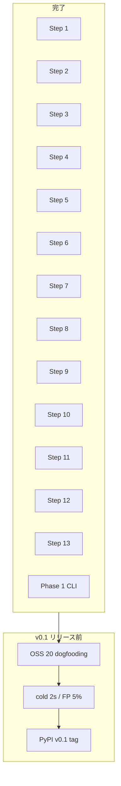

# yokei 実装プラン索引

`docs/dev/spec.ja.md` §6 パイプラインと §17 ロードマップに対応する設計ドキュメント一覧。
各プランは **update-plan 合格**（90点以上）を付記してから実装に進む。

**横断検証:** [`VALIDATION.md`](./VALIDATION.md)（Steps 9–13 + Phase 1 CLI、2026-06-13 合格）

## パイプライン Steps 1–13

| Step | ドキュメント | 状態 | 実装 |
| ---: | --- | --- | --- |
| 1 | [step-01-root-discovery.md](./step-01-root-discovery.md) | 確定 | ✅ |
| 2 | [step-02-config-load.md](./step-02-config-load.md) | 確定 | ✅ |
| 3 | [step-03-manifest-extraction.md](./step-03-manifest-extraction.md) | 確定 | ✅ |
| 4 | [step-04-source-file-discovery.md](./step-04-source-file-discovery.md) | 確定 | ✅ |
| 5 | [step-05-config-plugin-extraction.md](./step-05-config-plugin-extraction.md) | 確定 | ✅ |
| 6 | [step-06-python-parse.md](./step-06-python-parse.md) | 確定 | ✅ |
| 7 | [step-07-import-resolution.md](./step-07-import-resolution.md) | 確定 | ✅ |
| 8 | [step-08-entry-root-construction.md](./step-08-entry-root-construction.md) | 確定 | ✅ |
| 9 | [step-09-reachability-analysis.md](./step-09-reachability-analysis.md) | 確定 | ✅ |
| 10 | [step-10-dependency-reconciliation.md](./step-10-dependency-reconciliation.md) | 確定 | ✅ |
| 11 | [step-11-symbol-usage-analysis.md](./step-11-symbol-usage-analysis.md) | 確定 | ✅ |
| 12 | [step-12-issue-emission.md](./step-12-issue-emission.md) | 確定 | ✅ |
| 13 | [step-13-optional-fix.md](./step-13-optional-fix.md) | 確定 | ✅ |

## Phase 0 / Phase 1 横断

| 項目 | ドキュメント | 状態 | 実装 |
| --- | --- | --- | --- |
| Parser spike + graph core | [phase-0-parser-spike-graph-core.md](./phase-0-parser-spike-graph-core.md) | 確定 | ✅ |
| CLI 縦スライス（probe） | [phase-0-cli-vertical-slice.md](./phase-0-cli-vertical-slice.md) | 確定 | ✅ (`--probe`) |
| bundled maps | [step-07](./step-07-import-resolution.md) §3.2–3.3 | 確定 | 🟡 seed あり |
| wheel + PyPI release | spec §15, `release.yml` | CI のみ | ⬜ 未タグ |
| **フル CLI + reporter** | [phase-1-cli-reporter.md](./phase-1-cli-reporter.md) | 確定 | ✅ |
| OSS dogfooding 骨格 | `scripts/run-oss-fixture.sh` | 確定 | 🟡 骨格のみ |

## 推奨実装順（クリティカルパス）

## v0.1 リリース前の残作業（§17 exit criteria）

- OSS 20 プロジェクト dogfooding（`scripts/oss-fixtures.manifest` を拡張）
- YOK002/YOK003 誤検知率 5% 未満の計測・記録
- medium project cold 2s 以内
- PyPI `v0.1.0` タグ（Trusted Publishing 設定後）

## ADR

| ADR | 内容 |
| --- | --- |
| [0001-parser-selection.md](../adr/0001-parser-selection.md) | `rustpython-parser` 採用 |
