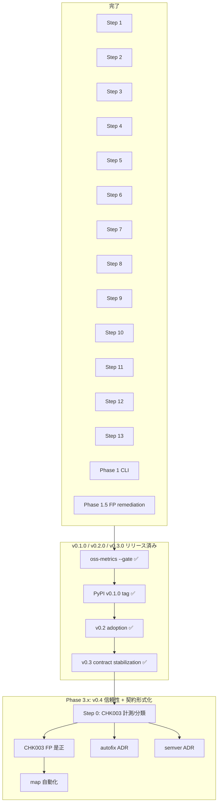

# chokkin 実装プラン索引

`docs/dev/spec.ja.md` §6 パイプラインと §17 ロードマップに対応する設計ドキュメント一覧。
各プランは **update-plan 合格**（90点以上）を付記してから実装に進む。

**横断検証:** [`VALIDATION.md`](./VALIDATION.md)（Steps 9–13 + Phase 1 CLI、2026-06-13 合格）

## パイプライン Steps 1–13

| Step | ドキュメント | 状態 | 実装 |
| ---: | --- | --- | --- |
| 1 | [step-01-root-discovery.md](./step-01-root-discovery.md) | 確定 | ✅ |
| 2 | [step-02-config-load.md](./step-02-config-load.md) | 確定 | ✅ |
| 3 | [step-03-manifest-extraction.md](./step-03-manifest-extraction.md) | 確定 | ✅ |
| 4 | [step-04-source-file-discovery.md](./step-04-source-file-discovery.md) | 確定 | ✅ |
| 5 | [step-05-config-plugin-extraction.md](./step-05-config-plugin-extraction.md) | 確定 | ✅ |
| 6 | [step-06-python-parse.md](./step-06-python-parse.md) | 確定 | ✅ |
| 7 | [step-07-import-resolution.md](./step-07-import-resolution.md) | 確定 | ✅ |
| 8 | [step-08-entry-root-construction.md](./step-08-entry-root-construction.md) | 確定 | ✅ |
| 9 | [step-09-reachability-analysis.md](./step-09-reachability-analysis.md) | 確定 | ✅ |
| 10 | [step-10-dependency-reconciliation.md](./step-10-dependency-reconciliation.md) | 確定 | ✅ |
| 11 | [step-11-symbol-usage-analysis.md](./step-11-symbol-usage-analysis.md) | 確定 | ✅ |
| 12 | [step-12-issue-emission.md](./step-12-issue-emission.md) | 確定 | ✅ |
| 13 | [step-13-optional-fix.md](./step-13-optional-fix.md) | 確定 | ✅ |

## Phase 0 / Phase 1 / Phase 1.5 横断

| 項目 | ドキュメント | 状態 | 実装 |
| --- | --- | --- | --- |
| Parser spike + graph core | [phase-0-parser-spike-graph-core.md](./phase-0-parser-spike-graph-core.md) | 確定 | ✅ |
| CLI 縦スライス（probe） | [phase-0-cli-vertical-slice.md](./phase-0-cli-vertical-slice.md) | 確定 | ✅ (`--probe`) |
| bundled maps | [step-07](./step-07-import-resolution.md) §3.2–3.3 | 確定 | 🟡 seed あり |
| wheel + PyPI release | spec §15, `release.yml` | 確定 | ✅ v0.1.0 |
| **フル CLI + reporter** | [phase-1-cli-reporter.md](./phase-1-cli-reporter.md) | 確定 | ✅ |
| OSS dogfooding + §17 gate | `scripts/oss-metrics.sh` | 確定 | ✅ 計測済み |
| **v0.1 誤検知是正** | [phase-1.5-fp-remediation.md](./phase-1.5-fp-remediation.md) | 確定 | ✅ |
| **v0.2 導入支援** | [phase-2-v0.2-adoption.md](./phase-2-v0.2-adoption.md) | 完了 | ✅ |
| **v0.3 契約安定化** | spec §17 Phase 3 | 完了 | ✅ |

## 推奨実装順（クリティカルパス）

## v0.4 計画

| 項目 | 状態 |
| --- | --- |
| [v0.4 信頼性＋契約形式化](phase-3x-v0.4-reliability-contract.md) | 計画済み |

## v0.1.0 リリース結果（§17 exit criteria）

**計測済み (2026-06-14, Phase 1.5 完了後):** crash 0 ✅、cold medium ≤ 2s ✅、CHK002 FP **0%** ✅。
詳細は [`oss-validation-report.md`](../oss-validation-report.md)。

リリース済み:

1. PyPI `v0.1.0` タグ ✅

Phase 1.5（[phase-1.5-fp-remediation.md](./phase-1.5-fp-remediation.md)）は完了済み:

1. **4.D** package-module-map 拡充 + 自己参照 extra guard（~11 件）
2. **4.A** binary + config usage detection（~110 件）
3. **4.B** dev context policy + PDM/Hatch 読取
4. **4.C** optional / conditional import tracing
5. `make oss-metrics ARGS=--gate` 再計測 → CHK002 FP < 5% ✅
6. PyPI `v0.1.0` タグ ✅

## v0.2 中期計画 — ✅ 完了

Phase 2 は「導入支援」をテーマに、baseline / CI reporter / workspace /
cache / plugin 拡充を順に進めた。詳細は
[`phase-2-v0.2-adoption.md`](./phase-2-v0.2-adoption.md)。
v0.2 release validation は `docs/dev/v0.2-release-validation.md` に記録済み。

## v0.3 契約安定化 — ✅ 完了

Phase 3 (v0.3) は JSON/baseline の `schema_version`、公開 JSON Schema
(`docs/schema/`)、`[tool.chokkin.severity]` override、SARIF rule metadata、
ignore 構文の回帰テスト、plugin API RFC (`docs/adr/0002-plugin-api-rfc.md`)
を中心に進める。外部 plugin loading は v0.3 では公開しない。
詳細は `docs/dev/spec.ja.md` §17 Phase 3。

## ADR

| ADR | 内容 |
| --- | --- |
| [0001-parser-selection.md](../adr/0001-parser-selection.md) | `rustpython-parser` 採用 |
| [0002-plugin-api-rfc.md](../adr/0002-plugin-api-rfc.md) | 外部 plugin API RFC (v0.3; loading 未実装) |
