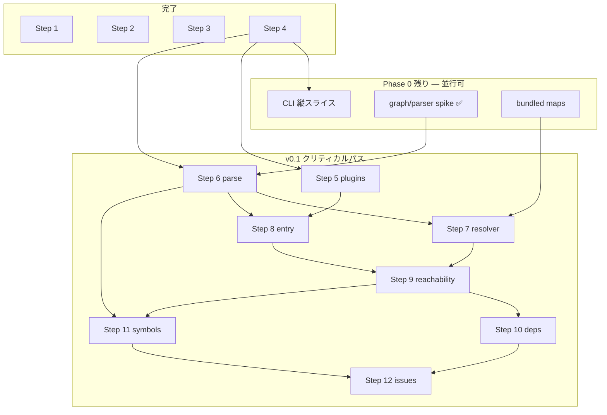

# yokei 実装プラン索引

`docs/dev/spec.ja.md` §6 パイプラインと §17 ロードマップに対応する設計ドキュメント一覧。
各プランは **update-plan 合格**（90点以上）を付記してから実装に進む。

## パイプライン Steps 1–13

| Step | ドキュメント | 状態 | 実装 |
| ---: | --- | --- | --- |
| 1 | [step-01-root-discovery.md](./step-01-root-discovery.md) | 確定 | ✅ |
| 2 | [step-02-config-load.md](./step-02-config-load.md) | 確定 | ✅ |
| 3 | [step-03-manifest-extraction.md](./step-03-manifest-extraction.md) | 確定 | ✅ |
| 4 | [step-04-source-file-discovery.md](./step-04-source-file-discovery.md) | 確定 | ✅ |
| 5 | [step-05-config-plugin-extraction.md](./step-05-config-plugin-extraction.md) | 確定 | ⬜ |
| 6 | [step-06-python-parse.md](./step-06-python-parse.md) | 確定 | 🟡 spike のみ |
| 7 | [step-07-import-resolution.md](./step-07-import-resolution.md) | 確定 | ⬜ |
| 8 | [step-08-entry-root-construction.md](./step-08-entry-root-construction.md) | 確定 | ⬜ |
| 9 | reachability analysis | **未設計** | ⬜ |
| 10 | dependency reconciliation | **未設計** | ⬜ |
| 11 | symbol usage analysis | **未設計** | ⬜ |
| 12 | issue emission | **未設計** | ⬜ |
| 13 | optional fix | **未設計** | ⬜ |

## Phase 0 横断

| 項目 | ドキュメント | 状態 | 実装 |
| --- | --- | --- | --- |
| Parser spike + graph core | [phase-0-parser-spike-graph-core.md](./phase-0-parser-spike-graph-core.md) | 確定 | 🟡 骨格あり |
| CLI 縦スライス | [phase-0-cli-vertical-slice.md](./phase-0-cli-vertical-slice.md) | 確定 | ⬜ |
| bundled maps | step-07 §3.2–3.3 に包含 | 確定 | ⬜ |
| wheel + PyPI release | spec §15, `release.yml` | CI のみ | ⬜ 未タグ |

## 推奨実装順（クリティカルパス）

## 次に設計すべきもの

1. **Step 9: reachability analysis** — BFS、`File reaches File`、`ConfigReference` 辺
2. **Step 10: dependency reconciliation** — YOK002–YOK005, lockfile transitive
3. **Step 11: symbol usage analysis** — YOK006–YOK007, decorator externally-used
4. **Step 12: issue emission** — reporter 接続前の `Issue` 型と confidence フィルタ
5. **Phase 1 CLI** — `clap`、`--explain` / `--trace`、reporter

## ADR

| ADR | 内容 |
| --- | --- |
| [0001-parser-selection.md](../adr/0001-parser-selection.md) | `rustpython-parser` 採用 |
