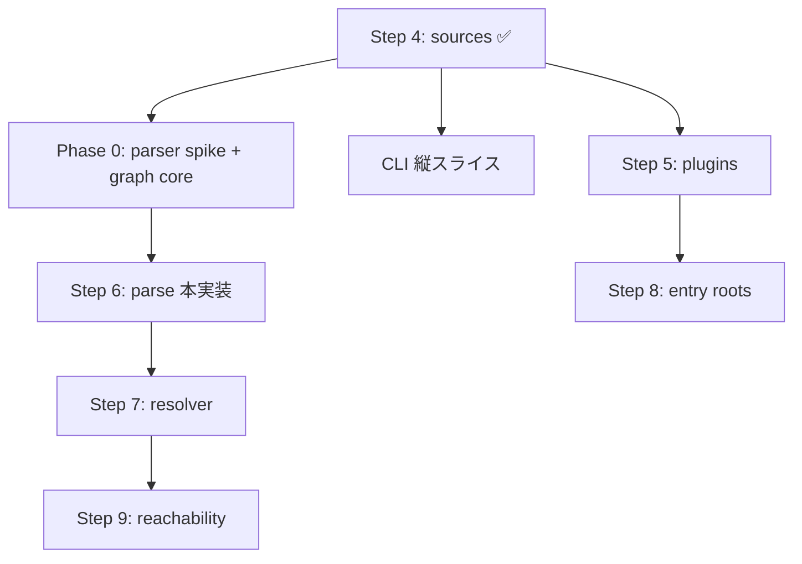

# Phase 0: Parser Spike + Graph Core 設計

Step 4 (`discover_sources`) 完了後の **クリティカルパス** 設計。
解析エンジン §6 の **処理ステップ 6 (Python parse)** を実装する前に、Phase 0 exit criteria
（§17）で求められる **parser 選定** と **graph core 骨格** を固める。

> **並行 work（本ドキュメント外）**
>
> - **CLI 縦スライス**: Steps 1–4 を `main.rs` から呼び、layout / manifest 件数 / `.py` 件数を表示（Phase 0 exit の一部）
> - **Step 5 (config/plugin extraction)**: [`step-05-config-plugin-extraction.md`](./step-05-config-plugin-extraction.md) — Step 6 と部分並行可（§17 後半）

## 1. 目的

| 項目 | 内容 |
| --- | --- |
| 解決する問題 | Python ソースを静的解析し、到達性グラフに載せるための **パーサ選定** と **内部グラフ型** を先に確定する |
| 成果物 | (A) parser spike + ADR、(B) `src/graph/` + `src/parser/` の型と最小 API、(C) サンプル fixture での end-to-end spike |
| Phase 0 との関係 | §17 Phase 0 exit の未達項目。Step 6–12 の前提 |
| 後続ステップへの入力 | Step 6 (parse)、Step 7 (resolver)、Step 8–9 (entry / reachability)、Step 10–12 (rules / issues) |

## 2. スコープ

### In scope

#### 2.1 Parser spike

- **候補評価**: Ruff ecosystem parser (`ruff_python_parser` 等) vs `rustpython-parser`（§6）
- **評価軸**: ライセンス、保守性、Python 3.10–3.13+ 構文対応、token / comment / string literal 保持、wheel サイズ、Astral API 安定性リスク
- **spike 実装**: 代表 fixture 10 件で parse 成功率・エラー分類を計測
- **ADR 記録**: `docs/adr/NNNN-parser-selection.md` に決定と fallback 方針を残す
- **最小 `parse_file` API**: 1 ファイル → `ParsedModule`（imports / string refs / ignores の抽出は Step 6 本実装）

#### 2.2 Graph core

- §6 の内部モデル骨格: `ProjectGraph` と node / edge 型
- `DiscoveredSources` / `LoadedManifest` から **File ノード** と **Distribution ノード** を初期化
- edge 種別の enum と追加 API（集約は Step 9）
- **ID 設計**: 安定な `FileId` / `ModuleId` / `SymbolId`（`petgraph` の node index とは分離）
- テスト用の空 graph 構築と edge 追加

#### 2.3 縦スライス spike（graph + parser 接続）

```text
discover_sources → parse_file (各 .py) → graph に File imports Module 辺を追加
```

本 PR では **import 文のトップレベル module 名** のみ抽出（相対 import・`importlib`・`TYPE_CHECKING` は Step 6–7）。

### Out of scope（後続ステップ）

| 項目 | 担当ステップ |
| --- | --- |
| 全 import 形式・動的 import・`__all__` / decorator 解析 | Step 6 (parse) 本実装 |
| import 名 ↔ distribution 名解決 | Step 7 (resolver) |
| bundled package-module-map / binary map | Step 7 / Phase 0 別 PR |
| entry root 推定・到達性 BFS | Step 8–9 |
| pytest / django / fastapi plugin 設定解析 | Step 5 (plugins) |
| YOK001–YOK010 issue 判定 | Step 10–12 |
| CLI reporter / `--explain` / `--trace` | Phase 1 CLI PR |
| bundled package-module-map / binary map 初版 | Step 7 / Phase 0 **別 PR**（§17） |
| wheel build matrix + PyPI Trusted Publishing | Phase 0 **別 PR**（§17, §15） |
| 並列 parse / cache | §19 — v0.1 後半 |
| `setup.py` の AST 化 | Step 6 完了後（Step 3 限定パーサから移行） |

## 3. 仕様との対応

### 3.1 内部グラフモデル（§6）

```text
ProjectGraph
  ├── files: IndexMap<FileId, FileNode>
  ├── modules: IndexMap<ModuleId, ModuleNode>
  ├── symbols: IndexMap<SymbolId, SymbolNode>   # Step 6 後半で使用開始
  ├── distributions: IndexMap<DistributionId, DistributionNode>
  └── edges: GraphEdges
```

**edge 種別（Phase 0 で型定義、Step 6–11 で段階的に追加）:**

```text
File imports Module          # Step 6 spike
Module defines Symbol        # Step 6 本実装
Module reexports Symbol      # Step 6 本実装
Distribution provides Module # Step 7
Manifest declares Distribution # Step 3 データを graph へ投入
ConfigReference uses Module  # Step 5
ConfigReference uses Binary  # Step 5
Entry reaches File           # Step 8
File reaches File            # Step 9（import 推移閉包）
```

Phase 0 では `Manifest declares Distribution` と `File imports Module` の 2 種のみ実装する。

### 3.2 Parser 要件（§6, §18, §20）

パーサは AST だけでなく以下を保持できること:

```text
- token 位置（行・列）— issue レポート用
- comments — `# yokei: ignore[YOK003]` 等（§18）
- string literals — Django INSTALLED_APPS、pytest_plugins 等（Step 5 が消費）
```

**実行禁止** — 解析対象 Python を import / exec しない（§20）。

### 3.3 `DiscoveredSources` との接続

| sources フィールド | graph へのマッピング |
| --- | --- |
| `files[].path` | `FileNode { path, context, kind }` |
| `files[].context` | `FileNode.context`（Step 10 YOK005 入力） |
| `layout.packages` | first-party `ModuleNode` プレフィックス推定（Step 7） |
| `root` | `ProjectGraph.root` |

### 3.4 `LoadedManifest` との接続

| manifest フィールド | graph へのマッピング |
| --- | --- |
| `dependencies[]` | `DistributionNode` + `ManifestDeclares` edge |
| `entry_points[]` | Step 8 で `Entry` ノード化（Phase 0 では manifest 参照のみ保持） |
| `lockfile_graph` | Step 7 / YOK004 入力（Phase 0 では graph に未投入可） |

## 4. モジュール構成

```
src/
  lib.rs
  graph/
    mod.rs           # pub use + ProjectGraph builder
    types.rs         # FileId, ModuleId, edge enums, node structs
    edges.rs         # add_import, add_manifest_decl, …
    build.rs         # build_graph_skeleton(manifest, sources)
    error.rs         # GraphError
  parser/
    mod.rs
    types.rs         # ParsedModule, ImportRef, ParseDiagnostic
    parse.rs         # parse_file(path, target_version) -> Result<ParsedModule, ParseError>
    error.rs         # ParseError
    spike/           # #[cfg(test)] または feature = "parser-spike" — 比較用のみ
      ruff.rs
      rustpython.rs
```

`resolver/` は Step 7 で追加。Phase 0 では `ModuleId` は **dotted name 文字列** の正規化のみ。

## 5. データ型

### 5.1 Graph IDs（newtype）

```rust
#[derive(Debug, Clone, Copy, PartialEq, Eq, Hash)]
pub struct FileId(pub u32);

#[derive(Debug, Clone, Copy, PartialEq, Eq, Hash)]
pub struct ModuleId(pub u32);

#[derive(Debug, Clone, Copy, PartialEq, Eq, Hash)]
pub struct DistributionId(pub u32);
```

`path → FileId` / `module_name → ModuleId` の intern table を `ProjectGraph` が保持。

### 5.2 Node 構造体

```rust
#[derive(Debug, Clone, PartialEq, Eq)]
pub struct FileNode {
    pub path: String,           // root-relative, `/` separators
    pub context: FileContext,   // from sources
    pub kind: FileKind,
}

#[derive(Debug, Clone, PartialEq, Eq)]
pub struct ModuleNode {
    /// Normalized dotted name (`acme.utils`, never leading `.`).
    pub name: String,
    pub origin: ModuleOrigin,
}

#[derive(Debug, Clone, Copy, PartialEq, Eq)]
pub enum ModuleOrigin {
    FirstParty,
    Stdlib,      // Step 7
    ThirdParty,  // Step 7
    Unknown,
}

#[derive(Debug, Clone, PartialEq, Eq)]
pub struct DistributionNode {
    pub name: String,           // PEP 508 normalized name
    pub contexts: Vec<DependencyContext>, // from manifest
}
```

### 5.3 Edge 記録

Phase 0 では隣接リスト形式で十分（`petgraph` は Step 9 の reachability で導入検討）:

```rust
#[derive(Debug, Clone, PartialEq, Eq)]
pub enum GraphEdge {
    FileImportsModule { file: FileId, module: ModuleId, line: u32 },
    ManifestDeclaresDistribution {
        distribution: DistributionId,
        source: DependencyOrigin, // reuse manifest type
    },
}

#[derive(Debug, Default)]
pub struct ProjectGraph {
    pub root: ProjectRoot,
    files: IndexMap<FileId, FileNode>,
    modules: IndexMap<ModuleId, ModuleNode>,
    distributions: IndexMap<DistributionId, DistributionNode>,
    edges: Vec<GraphEdge>,
    // intern maps
}
```

### 5.4 Parser 出力（spike 最小）

```rust
#[derive(Debug, Clone, PartialEq, Eq)]
pub struct ImportRef {
    pub module: String,   // top-level or dotted
    pub line: u32,
    pub kind: ImportKind,
}

#[derive(Debug, Clone, Copy, PartialEq, Eq)]
pub enum ImportKind {
    Import,
    ImportFrom,
}

#[derive(Debug, Clone, PartialEq, Eq)]
pub struct ParsedModule {
    pub path: String,
    pub imports: Vec<ImportRef>,
    pub diagnostics: Vec<ParseDiagnostic>,
}

#[derive(Debug, Clone, PartialEq, Eq)]
pub struct ParseDiagnostic {
    pub line: u32,
    pub message: String,
    pub severity: ParseSeverity,
}

#[derive(Debug, Clone, Copy, PartialEq, Eq)]
pub enum ParseSeverity {
    Error,
    Warning,
}
```

構文エラーは `ParseError` ではなく `ParsedModule.diagnostics` に積み、解析は継続（§20: 1 ファイル失敗で全体を止めない）。

### 5.5 エラー型

```rust
#[derive(Debug, thiserror::Error)]
pub enum GraphError {
    #[error("duplicate file path `{path}`")]
    DuplicateFile { path: String },
    #[error("graph invariant violated: {detail}")]
    Invariant { detail: String },
}

#[derive(Debug, thiserror::Error)]
pub enum ParseError {
    #[error("failed to read `{path}`")]
    Io { path: PathBuf, #[source] source: std::io::Error },
    #[error("unsupported python syntax in `{path}`: {detail}")]
    UnsupportedSyntax { path: String, detail: String },
}
```

## 6. 公開 API

```rust
// src/graph/mod.rs

pub use build::build_graph_skeleton;
pub use types::{FileId, ModuleId, DistributionId, ProjectGraph, GraphEdge, …};

/// Initialize graph nodes from pipeline steps 1–4 outputs.
pub fn build_graph_skeleton(
    manifest: &LoadedManifest,
    sources: &DiscoveredSources,
) -> Result<ProjectGraph, GraphError>;

/// Attach import edges from a parsed module.
pub fn add_parsed_imports(
    graph: &mut ProjectGraph,
    file_id: FileId,
    parsed: &ParsedModule,
) -> Result<(), GraphError>;
```

```rust
// src/parser/mod.rs

pub use parse::parse_file;
pub use types::{ParsedModule, ImportRef, ParseDiagnostic};

/// Parse one `.py` file (static only, never executes).
pub fn parse_file(
    root: &ProjectRoot,
    path: &str,
    target: TargetVersion,
) -> Result<ParsedModule, ParseError>;
```

`lib.rs` から re-export:

```rust
pub mod graph;
pub mod parser;
pub use graph::{build_graph_skeleton, ProjectGraph, …};
pub use parser::{parse_file, ParsedModule, …};
```

## 7. Parser spike 評価マトリクス

| 観点 | 配点 | Ruff ecosystem | RustPython |
| --- | ---: | --- | --- |
| ライセンス (MIT/Apache 互換) | 15 | 要確認（多くは MIT） | MIT |
| 構文カバレッジ 3.10–3.13 | 20 | 高（Ruff 本体と同期） | 中〜高 |
| comment / token 保持 | 20 | 高 | 中 |
| wheel サイズ増分 | 10 | 中 | 大きめ |
| API 安定性 | 20 | 低（crate 分割・非公開リスク） | 中 |
| 保守コスト | 15 | 低（追従は楽、バージョン固定必要） | 中 |
| **合計** | **100** | **TBD** | **TBD** |

**判定ルール:**

1. スコア差 **< 5 点** → Ruff を優先（性能・構文追従）
2. Ruff の採用時 → `Cargo.toml` で **exact version pin** + ADR に vendoring 再検討トリガーを記載
3. spike で fixture 成功率 **< 95%** → 失敗パターンを列挙し、Step 6 スコープ調整

### 7.1 Spike fixture セット（`tests/fixtures/parser_spike/`）

| # | 内容 | 確認点 |
| --- | --- | --- |
| P1 | 空 `__init__.py` | 空ファイル |
| P2 | `import os` / `from x import y` | 基本 import |
| P3 | relative `from . import sibling` | 相対（Phase 0 は記録のみ、解決は Step 7） |
| P4 | `if TYPE_CHECKING:` ブロック | 条件付き import |
| P5 | `try: import optional` | try-import |
| P6 | f-string / pattern matching (3.10+) | 新構文 |
| P7 | `match` / `type` alias (3.12+) | 新構文 |
| P8 | `# yokei: ignore[YOK003]` コメント | comment 保持 |
| P9 | 構文エラー含有 | diagnostic 継続 |
| P10 | `src/layout` の実プロジェクト断片 | 実戦 |

## 8. テスト戦略

### 8.1 単体テスト

| モジュール | テストファイル | 重点 |
| --- | --- | --- |
| `graph/types` | `src/graph/types.rs` `#[cfg(test)]` | ID intern、edge 追加 |
| `graph/build` | `tests/graph_build.rs` | manifest + sources → node 数 |
| `parser/parse` | `tests/parser_parse.rs` | fixture P1–P10 |
| spike 比較 | `tests/parser_spike.rs` | 両パーサ成功率（`#[ignore]` 可） |

### 8.2 統合テスト

```rust
#[test]
fn pipeline_phase0_spike() -> Result<(), Box<dyn std::error::Error>> {
    let root = discover_project_root(fixture)?;
    let loaded = load_config(&root)?;
    let manifest = extract_manifest(&root, &loaded)?;
    let sources = discover_sources(&root, &loaded, &manifest)?;
    let target = resolve_target_version(&loaded.effective, &manifest);
    let mut graph = build_graph_skeleton(&manifest, &sources)?;
    for file in sources.python_files() {
        let parsed = parse_file(&root, &file.path, target)?;
        let file_id = graph
            .file_id(&file.path)
            .ok_or("discovered file missing from graph")?;
        add_parsed_imports(&mut graph, file_id, &parsed)?;
    }
    assert!(!graph.edges().is_empty());
    Ok(())
}
```

`graph.file_id` は `Option<FileId>` を返す（production / テストとも `unwrap` 禁止）。

### 8.3 回帰方針

- parser 選定後、spike テストを **選定パーサのみ** に絞る
- 構文エラー fixture は常に `diagnostics` に落ちることを固定

## 9. 依存関係

| Crate | 用途 | Phase 0 |
| --- | --- | --- |
| `indexmap` | 安定順序の intern table | Yes |
| `ruff_python_parser` + `ruff_python_ast` 等 | spike 候補 A | spike 後に 1 つだけ残す |
| `rustpython-parser` | spike 候補 B | spike 後に削除 or 残す |
| `thiserror` | エラー型 | 既存 |
| `petgraph` | reachability | **No** — Step 9 |

追加後 `make check`（`cargo deny check` 含む）を通す。

## 10. Exit criteria（Phase 0 parser + graph 完了定義）

- [ ] `docs/adr/NNNN-parser-selection.md` がマージされている
- [ ] `src/graph/` が `make check` を通過する
- [ ] `src/parser/` が `make check` を通過する（選定パーサ 1 つのみ依存）
- [ ] `build_graph_skeleton` + `parse_file` + `add_parsed_imports` が `lib.rs` から re-export される
- [ ] spike fixture 10 件で選定パーサの成功率 ≥ 95%
- [ ] `pipeline_phase0_spike` 統合テストが通る
- [ ] production コードに `unwrap` / `expect` / `panic` がない
- [ ] `docs/dev/spec.ja.md` §15 のモジュール一覧に `graph/` / `parser/` が追記される（`update-docs`）
- [ ] `AGENTS.md` の `(future)` 記載が更新される

## 11. 実装順序（推奨）

```text
1. docs/adr/ テンプレートで parser spike 計画を起票
2. tests/fixtures/parser_spike/* — fixture 10 件
3. parser/spike/* — 両パーサ比較（feature または tests のみ）
4. ADR 作成・パーサ決定
5. graph/types.rs — ID / node / edge
6. graph/build.rs — build_graph_skeleton
7. parser/types.rs + parser/parse.rs — 選定パーサで parse_file
8. graph/edges.rs — add_parsed_imports
9. lib.rs — pub mod graph, parser
10. tests/graph_build.rs, tests/parser_parse.rs, pipeline_phase0_spike
11. make check
12. update-docs（spec.ja.md §15, AGENTS.md）
13. spike 用未採用クレート・コード削除
```

所要: 新規 Rust ファイル 10 前後、ADR 1、fixture 10、依存 1–3 crate（spike 後 1–2 に整理）。

## 12. 並行 work（推奨スケジュール）



| work | 依存 | 成果 |
| --- | --- | --- |
| **Phase 0（本プラン）** | Step 4 | parser ADR、`ProjectGraph`、`parse_file` spike |
| **CLI 縦スライス** | Step 4 | [`phase-0-cli-vertical-slice.md`](./phase-0-cli-vertical-slice.md) — `probe_project` |
| **Step 5 plugins** | Step 2–4 | [`step-05-config-plugin-extraction.md`](./step-05-config-plugin-extraction.md) |
| **Step 6 parse 本実装** | Phase 0 spike | [`step-06-python-parse.md`](./step-06-python-parse.md) |
| **Step 7 resolver + maps** | Step 6 | [`step-07-import-resolution.md`](./step-07-import-resolution.md) |
| **Step 8 entry roots** | Step 5–6 | [`step-08-entry-root-construction.md`](./step-08-entry-root-construction.md) |

プラン索引: [`README.md`](./README.md)

## 13. 未決事項

| 項目 | 理由 | 再検討 |
| --- | --- | --- |
| `petgraph` vs 自前 BFS | Phase 0 では edge 追加のみ | Step 9 |
| Ruff parser crate の exact 構成 | Astral の crate 分割は変動 | spike 時に固定 |
| `.pyi` の parse | stub は型情報のみ | Step 6 — 当面 skip |
| `target_version` と構文 feature gate | 古い target で新構文を error | parse 時に diagnostic |
| `SymbolId` の導入時期 | unused export は Phase 1 後半 | Step 6 後半 |

## 14. update-plan 検証サマリ（確定）

### Phase 1: コンテキスト収集

| 成果物 | 確認結果 |
| --- | --- |
| `docs/dev/plans/phase-0-parser-spike-graph-core.md` | 本プラン |
| `docs/dev/spec.ja.md` §6, §15, §17, §19 | graph モデル・Phase 0 exit と一致 |
| `docs/dev/plans/step-04-source-file-discovery.md` §17 | 推奨順序と一致 |
| `docs/dev/plans/step-05-config-plugin-extraction.md` | 並行 work。graph 辺は Step 8 で統合 |
| `AGENTS.md` | `parser/` / `graph/` は `(future)` — 実装時 update-docs |
| `Cargo.toml` | 現行依存に parser/graph なし。`indexmap` 追加予定 |
| `src/sources/types.rs` | `python_files()` 確定済み |
| `src/manifest/`, `src/config/` | 入力 API 確定済み |

### Phase 2: 品質評価（100点満点）

| カテゴリ | 配点 | 得点 | 所見 |
| --- | ---: | ---: | --- |
| モジュール / struct 設計 | 20 | 19 | graph / parser 分離。ID intern 明示 |
| 静的解析制約 | 20 | 20 | Python 非実行を維持 |
| ルール / ポリシー | 20 | 17 | issue 判定は Step 10–12。spike は import のみ |
| エラー処理 | 20 | 19 | 構文エラーは diagnostic 継続。統合テスト例から `unwrap` 除去 |
| テスト容易性 | 20 | 19 | fixture 10 + 統合 1 本を具体化 |
| **合計** | **100** | **94** | **合格**（90 以上） |

### Phase 3: 整合性チェック

| チェック項目 | 結果 |
| --- | --- |
| プランと `spec.ja.md` §6 処理順 | OK — Step 6 の前提として位置付け |
| Step 4 出力 `DiscoveredSources` | OK — `FileNode` へ直接マップ |
| Step 3 出力 `LoadedManifest` | OK — `DistributionNode` へマップ |
| `resolve_target_version` | OK — 統合テストで manifest 後に解決 |
| `src/` 現行構成との衝突 | なし — 新規 `graph/`, `parser/` |
| Phase 0 exit（§17） | 部分達成 — 本 PR は parser/graph。maps / wheel / CLI は別 PR |

### Phase 4: 改善反映（課題分類）

| 優先度 | 課題 | 対応 |
| --- | --- | --- |
| **P0** | 統合テスト例が `unwrap` を使用 | §8.2 を `Option` + `?` に修正済み |
| **P1** | §17 の maps / wheel CI がスコープ不明瞭 | Out of scope に明記 |
| **P1** | `build_graph_skeleton` シグネチャとモジュールコメント不一致 | `build.rs` コメント修正済み |
| **P2** | `SymbolNode` 型が Phase 0 で未使用 | §13 で Step 6 後半に委譲 |

### 確定判定

**合格 — 実装着手可。** Phase 0 parser + graph は Step 4 のみに依存し、
Step 6 本実装のブロッカーを解消する。
