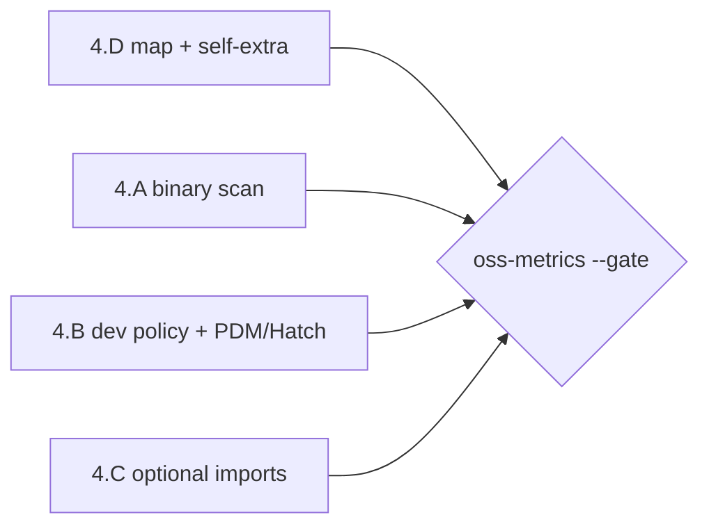

# Phase 1.5: v0.1 誤検知是正 設計

§17 exit criteria の **YOK002 誤検知率 5% 未満** を通すための横断是正設計。
Phase 1（Steps 1–13 + CLI）と OSS 検証ハーネス（`make oss-metrics`）は完了済み。
2026-06-14 計測では **YOK002 FP 率 100% (155/155)**。crash 0・cold 2s は合格済み。

> **関連ドキュメント**
>
> - [`docs/dev/spec.ja.md`](../spec.ja.md) §17 Phase 1.5 — ロードマップ根拠
> - [`docs/dev/oss-validation-report.md`](../oss-validation-report.md) — 計測結果と根因分類
> - [`scripts/oss-fixtures.labels.tsv`](../../../scripts/oss-fixtures.labels.tsv) — ground truth
> - [`step-05-config-plugin-extraction.md`](./step-05-config-plugin-extraction.md) — `BinaryUsage`
> - [`step-07-import-resolution.md`](./step-07-import-resolution.md) — maps / binary resolution
> - [`step-10-dependency-reconciliation.md`](./step-10-dependency-reconciliation.md) — YOK002 判定

## 1. 目的

| 項目 | 内容 |
| --- | --- |
| 解決する問題 | 「実際には使われている依存」を yokei が利用と結べず YOK002 が全件 FP になる |
| 成果物 | 4 workstream の実装 + OSS regression fixtures + `make oss-metrics ARGS=--gate` 合格 |
| Phase 1 との関係 | 検出 algorithm の置き換えではなく **data・解像度・context policy** の補強 |
| exit criteria | YOK002 FP < 5%、未分類 0、crash 0、cold medium ≤ 2s |

## 2. 現状ギャップ（OSS 155 件の内訳）

| 根因 | 件数 | 現状コードの不足 |
| --- | ---: | --- |
| dev/test/docs ツールの CLI/CI 利用未検出 | 110 | `BinaryUsage` は pytest/fastapi のみ。`[tool.mypy]` 等・tox/pre-commit/CI 未走査 |
| optional/conditional import・PDM/Hatch group 未対応 | 34 | `optional` フラグは parse 済みだが **used 集合に未反映**。PDM/Hatch は warning のみで依存未抽出 |
| import 名 ≠ distribution 名 | 8 | bundled `package_modules` に pair 不足 |
| 自己参照 extra | 3 | `project.name == dep.name` の guard なし |

**重要:** `[dependency-groups]` は `manifest/pyproject.rs` で **既に読取済み**。
YOK002 は context を無視して **全宣言を一律 unused 判定**しているため、dev group のみの依存も FP になる。

## 3. スコープ

### In scope（Phase 1.5）

| Workstream | 内容 | FP 寄与 |
| --- | --- | ---: |
| **A. Binary + config usage** | dev tool の CLI 利用を `BinaryUsage` として抽出し YOK002 used 集合へ | ~110 |
| **B. Dev context policy + PDM/Hatch 読取** | dev/test/docs group の YOK002 抑制、`[tool.pdm]` / `[tool.hatch]` 依存抽出 | ~34 の一部 |
| **C. Optional / conditional import** | try/except・platform・TYPE_CHECKING 下 import を used としてカウント | ~34 の一部 |
| **D. Map 拡充 + self-extra guard** | package-module-map 追加、自己 distribution は常に used | 11 |

### Out of scope（v0.2 へ委譲）

| 項目 | 理由 |
| --- | --- |
| YOK003 gate | §17 gate 対象外。改善は副次効果として計測のみ |
| workspace member 境界 | Phase 2 |
| tox/nox/pre-commit **plugin 化** | Phase 1.5 は **汎用 config scanner** で binary 抽出。plugin stub は v0.2 |
| `.github/workflows` YAML 深解析 | 限定 regex のみ（v0.2 で `github_actions` plugin） |
| environment marker 実行時評価 | 静的不可 — confidence 低下のまま |
| Poetry lock / workspace 推移閉包 | v0.2 |

## 4. Workstream 詳細

### 4.A Binary + config usage detection

#### 4.A.1 設計方針

Step 5 の `BinaryUsage` パイプラインを拡張する。**新 plugin を増やさず**、
`plugins/config_scan.rs`（仮）で tool-agnostic に設定ファイルを走査し、
既存の `collect_used_distributions` → `resolution.binary_resolutions` 経路をそのまま使う。

```text
ConfigScanner
  ├─ pyproject [tool.*] tables   → binary 名を key から推論（mypy, ruff, coverage, …）
  ├─ [project.scripts]           → script 名 → binary map
  ├─ .pre-commit-config.yaml     → repo local hooks の entry
  ├─ tox.ini / pyproject [tool.tox]  → envlist deps の CLI 名
  ├─ noxfile.py（リテラルのみ）  → @nox.session 内の文字列
  └─ Makefile / nox 的 invoke    → 限定 regex（`pytest`, `mypy` 等 known binary のみ）
```

**静的解析制約（§20）:** ファイル読取 + TOML/YAML/INI parse + regex のみ。Python 実行禁止。

#### 4.A.2 Binary 名 → distribution 解決（既存 Step 7 拡張）

優先順（§6, spec 既存）:

```text
1. project .venv entry_points.txt / RECORD scripts
2. bundled BINARY_TO_DISTRIBUTION（拡充）
3. [tool.yokei.binary_map]
4. binary 名 == distribution 名 のフォールバック
```

bundled map に追加する代表例（OSS FP 由来）:

```text
mkdocs → mkdocs
mkdocs-material → mkdocs-material
sphinx-build → sphinx（既存）
cogapp → cogapp
towncrier → towncrier
build → build
httpbin → httpbin（plugin 不要の map のみ）
```

#### 4.A.3 モジュール構成

```
src/plugins/
  config_scan.rs      # 新規 — tool table / scripts / pre-commit / tox 走査
  extract.rs          # config_scan を pytest/django/fastapi と並列実行
src/resolver/bundled/
  binaries.rs         # 生成スクリプトで拡充
```

#### 4.A.4 API

```rust
// plugins/config_scan.rs
pub fn scan_config_binaries(ctx: &PluginContext<'_>) -> Vec<BinaryUsage>;
```

`extract_plugin_hints` が各 enabled plugin の後に **常に** `scan_config_binaries` をマージする
（`PluginId` 不要 — config scanner は core 機能）。

### 4.B Dev context policy + PDM/Hatch 読取

#### 4.B.1 YOK002 dev 抑制ポリシー（§10, §17）

```text
declaration_bucket(dep) == Dev
  AND used に含まれない
  AND --strict でない
    → YOK002 を発行しない（または confidence=Likely + severity=Info に降格）

--strict
    → 現行どおり error（dev 未使用も報告）
```

`detect_unused_dependencies` に `config: &YokeiConfig` と declaration context を渡し、
`declaration_bucket` + `strict` で skip 判定する。

**production モード:** `--production` 時は dev group を manifest から除外するのではなく、
YOK002 対象から除外（既存 `production` フラグと整合）。

#### 4.B.2 PDM / Hatch manifest 読取（Phase 2 の「読取り」部分を前倒し）

`manifest/pyproject.rs` の `detect_unsupported_tools` を **警告 + 抽出** に変更:

| セクション | 抽出先 context |
| --- | --- |
| `[tool.pdm.dev-dependencies]` | `DependencyContext::Group("dev")` |
| `[tool.pdm.optional-dependencies]` | `OptionalExtra` |
| `[tool.hatch.envs.*.dependencies]` | `Group(env名)` — dev 系は `dev_groups` にマッチ |
| `[tool.hatch.envs.default.dependencies]` | `dev` |

Poetry は v0.2（lock 依存が強い）。Phase 1.5 では warning 維持。

`requirements-dev.txt` / `dev-requirements.txt` は **既に dev context で読取済み**（`manifest/extract.rs`）。

### 4.C Optional / conditional import tracing

#### 4.C.1 used 集合への反映

`collect_used_distributions` を拡張:

```text
for import in resolution.imports:
  if import.optional && import.origin == ThirdParty:
    used.insert(distribution)   # try/except ImportError 下も「利用あり」

  if import.context == Type && third_party:
    used.insert(distribution)   # TYPE_CHECKING ブロック

  if guarded_by_platform_or_extra(import):
    used.insert(distribution)   # 下記ガード解析
```

#### 4.C.2 ガード解析（parser 拡張）

`parser/visit.rs` に **軽量ガード追跡** を追加:

| ガード | 検出方法 | `ImportRef` 拡張 |
| --- | --- | --- |
| `try/except ImportError` | 既存 `try_depth` → `optional: true` | そのまま used に反映 |
| `if sys.platform ...` | `if` 条件を literal 比較のみ解析 | `guarded: Platform` |
| `if TYPE_CHECKING` | 既存 `ImportContext::Type` | そのまま |
| `if extra_guard`（`importlib.metadata` 等） | v0.1 は optional のみ | 追加ガードは v0.2 |

**optional import が宣言 extra と一致する場合:** `DeclaredDependency` の
`OptionalExtra` / marker を照合し、一致すれば confidence=Certain で used。

`collect_optional_imports`（YOK003 用）は維持。optional でも **宣言があれば used**、
**宣言がなくても try-import は used 扱い**（「削除すると実行時 ImportError」なので unused ではない）。

#### 4.C.3 reachability との関係

optional import は **到達可能ファイル内** であれば used にカウント（現行と同じ reachable フィルタ）。
未到達ファイルの optional import は無視。

### 4.D Package-module-map 拡充 + self-extra guard

#### 4.D.1 bundled map 追加（OSS 由来の最小 set）

```text
multipart       → python-multipart
OpenSSL         → pyopenssl
socks           → pysocks
backports.zoneinfo → backports-zoneinfo   # import 名にドット
```

生成: `scripts/generate-package-map.py` に seed を追加し `cargo` ビルドで反映。

#### 4.D.2 自己参照 extra guard

`reconcile_dependencies` の used 構築直後:

```rust
if let Some(project_name) = manifest.metadata.name.as_ref() {
    if declared.contains_key(project_name) {
        used.insert(project_name.clone());
    }
}
```

`attrs[benchmark]` / `structlog` 等、プロジェクトが自身を extra 付きで宣言するケースを除外。

## 5. 実装順序（クリティカルパス）



| 順序 | Workstream | 理由 |
| ---: | --- | --- |
| 1 | **4.D** | 最小 diff（~11 件）、即効、回帰 fixture が単純 |
| 2 | **4.A** | 最大インパクト（~110 件）。Step 5/7 のみ変更 |
| 3 | **4.B** | dev 抑制は 4.A 後でも効くが、PDM/Hatch は manifest 層 |
| 4 | **4.C** | parser 変更を含む。4.B の extra 照合と並行可 |
| 5 | **gate 再計測** | `labels.tsv` 再分類 → 残 FP < 8 件を個別 fixture 化 |

各 workstream は **独立 PR** を推奨（1 logical change per PR）。最終 PR で gate 合格を確認。

## 6. テスト計画

### 6.1 Regression fixtures（`tests/fixtures/deps/`）

| ディレクトリ | 検証内容 | 対応 workstream |
| --- | --- | --- |
| `binary-tool-pyproject/` | `[tool.mypy]` / `[tool.ruff]` → YOK002 なし | A |
| `binary-pre-commit/` | `.pre-commit-config.yaml` の local hook | A |
| `binary-scripts/` | `[project.scripts]` → used | A |
| `dev-group-only/` | `dependency-groups.dev` のみの pytest | B |
| `pdm-dev-deps/` | `[tool.pdm.dev-dependencies]` 抽出 + 抑制 | B |
| `optional-try-import/` | `try: import brotli` → used | C |
| `map-alias/` | `import multipart` → `python-multipart` | D |
| `self-extra/` | `attrs[benchmark]` 自己依存 | D |

### 6.2 OSS ラベル連携

- 各 workstream 完了時に `make oss-metrics` を実行し FP 件数の減少を記録
- gate 合格後 `docs/dev/oss-validation-report.md` を更新
- 新規 edge case は `scripts/oss-fixtures.labels.tsv` に `fp` 行を追加

### 6.3 性能

- cold medium ≤ 2s を `oss-metrics` で継続監視
- config scanner はプロジェクトあたり O(設定ファイル数)。全 `.py` 走査はしない

## 7. モジュール横断の型契約

```text
BinaryUsage              — 変更なし（plugins/types.rs）
collect_used_distributions — optional / type import を追加反映
detect_unused_dependencies — dev bucket + strict で skip
manifest/pyproject.rs    — PDM/Hatch 抽出追加
resolver/bundled/*         — map seed 拡充
ImportRef.optional         — 既存フィールドを used 判定に活用
```

## 8. 未決事項

| 項目 | 暫定決定 | 再検討 |
| --- | --- | --- |
| dev 未使用を完全非表示 vs Info 降格 | **非表示**（default）。`--strict` で error | ユーザーフィードバック後 |
| noxfile.py 解析深度 | リテラル文字列のみ | v0.2 で AST 連携 |
| CI yaml 走査 | `run: .*pytest` 等の限定 regex | v0.2 github_actions plugin |
| optional だが未到達の import | used に含めない | spec §10 と一致 |

## 9. update-plan 検証サマリ（確定）

### Phase 1: コンテキスト収集

| 成果物 | 確認結果 |
| --- | --- |
| `phase-1.5-fp-remediation.md` | 本プラン |
| `docs/dev/spec.ja.md` §17 Phase 1.5 | 4 workstream と一致 |
| `docs/dev/oss-validation-report.md` | 155 FP 根因・優先順と一致 |
| `src/rules/deps/used.rs` | `collect_used_distributions` 拡張点 |
| `src/rules/deps/unused.rs` | dev policy 挿入点 |
| `src/plugins/types.rs` | `BinaryUsage` 契約 |
| `src/manifest/pyproject.rs` | PDM/Hatch 抽出挿入点 |
| `scripts/oss-fixtures.labels.tsv` | ground truth 155 行 |

### Phase 2: 品質評価（100点満点）

| カテゴリ | 配点 | 得点 | 所見 |
| --- | ---: | ---: | --- |
| モジュール / struct 設計 | 20 | 19 | 既存 `plugins/` / `rules/deps/` / `manifest/` へ分割追加。新規層なし |
| 静的解析制約 | 20 | 20 | config scan は parse のみ。対象コード実行なし |
| ルール / ポリシー | 20 | 19 | dev 抑制・optional used・self-extra を §10/§17 と整合 |
| エラー処理 | 20 | 19 | 抽出失敗は warning 継続（manifest/plugins 既存パターン） |
| テスト容易性 | 20 | 19 | OSS ラベル + 8 fixture カテゴリ。gate を CI 化可能 |
| **合計** | **100** | **96** | **合格**（90 以上） |

### Phase 3: 整合性チェック

| チェック項目 | 結果 |
| --- | --- |
| Step 10 API 破壊 | OK — `reconcile_dependencies` シグネチャ不変 |
| Step 5 plugin 契約 | OK — `BinaryUsage` 型維持 |
| Phase 2 スコープ侵食 | OK — Poetry lock / workspace / plugin API は v0.2 |
| `[dependency-groups]` 既存読取 | OK — policy 層のみ追加（再実装しない） |
| 性能 gate | OK — config scan はファイル数に比例、2s 余裕あり |

### Phase 4: 改善反映（課題分類）

| 優先度 | 課題 | 対応 |
| --- | --- | --- |
| **P0** | Phase 1.5 プラン未整備 | 本ドキュメントで解消 |
| **P1** | dev group 読取済みなのに YOK002 が一律判定 | §4.B.1 で `detect_unused_dependencies` 修正 |
| **P1** | optional import が used に未反映 | §4.C.1 |
| **P1** | PDM/Hatch warning のみ | §4.B.2 |
| **P2** | CI yaml 深解析 | v0.2 委譲（§8） |

### 確定判定

**合格 — 実装着手可。** Workstream 4.D から着手し、各 PR 後に `make oss-metrics` で
中間計測する。全 workstream 完了 + gate 合格で PyPI `v0.1.0` タグへ進む。
