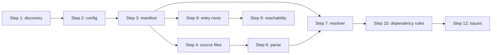

# Step 3: Manifest Extraction 設計

解析パイプライン §6 の **処理ステップ 3 (manifest extraction)** の実装設計。
Step 2 (`load_config`) の直後に位置し、プロジェクトの **依存宣言・lockfile・entry points・メタデータ**
を静的に抽出して、後続の import resolution / dependency reconciliation が参照する
`LoadedManifest` を供給する。

## 1. 目的

| 項目 | 内容 |
| --- | --- |
| 解決する問題 | 「何が宣言されているか」を複数ソースから統合し、context 付きの依存一覧と lockfile 推移閉包を型安全に提供する |
| 成果物 | `extract_manifest(&ProjectRoot, &LoadedConfig) -> Result<LoadedManifest, ManifestError>` |
| Phase 0 との関係 | graph core / parser spike と並行可能。TOML / テキスト静的パースのみで Python 非実行を維持 |
| 後続ステップへの入力 | Step 7 (import resolution) の distribution 名解決、Step 10 (dependency reconciliation) の CHK002–CHK005/CHK009 判定、Step 8 (entry root construction) の `[project.scripts]` 等 |

## 2. スコープ

### In scope

- root 直下および慣習的な相対パスにある **依存宣言ソース** を探索・読み込む（§4）
- 各依存を **PEP 508** としてパースし、distribution 名・extras・environment marker・宣言位置を保持する
- 依存を **context**（runtime / dev / test / optional-extra / dependency-group 名）に分類する（§10 の入力）
- `pyproject.toml` から **project metadata**（name / version / requires-python / dynamic）を抽出する
- `pyproject.toml` から **entry points**（`[project.scripts]` / `[project.gui-scripts]` / `[project.entry-points.*]`）を抽出する
- `uv.lock` から **推移閉包**（package → dependencies）を構築する（CHK004 判定の入力）
- `requirements*.txt` の `-r` 再帰追跡、`-c` constraints 参照、`-e` / path / VCS / URL 指定の分類
- `setup.cfg` の `[metadata]` / `[options]` install_requires / extras_require
- `setup.py` の **静的パース**（`install_requires` / `extras_require` のリテラル抽出のみ）
- 複数ソースの **マージ規則** と、どのファイルが寄与したかの記録
- 解析不能ソースに対する **warning**（解析継続。Step 12 で diagnostic として扱う）
- `src/manifest/` として単体テスト可能な library API を提供する

### Out of scope（後続ステップ）

| 項目 | 担当ステップ |
| --- | --- |
| `[tool.chokkin]` 設定の読み込み | Step 2 (config load) — 完了済み |
| `mode = "auto"` の app / library 解決 | Step 8 前の `resolve_mode` |
| ソースファイルの glob 探索・layout 推定 | Step 4 (source file discovery) |
| import 名 ↔ distribution 名の解決 | Step 7 (import resolution) |
| CHK002–CHK010 の issue 判定 | Step 10–12 |
| `[tool.poetry.*]` / PDM / Hatch の深掘り | v0.2（Step 3 では **検出のみ** — 存在すれば warning でスキップ） |
| uv workspace member の下方向自動スキャンと member 別 manifest | v0.2（Step 2 の `UvWorkspaceHint` は参照するが member 展開はしない） |
| `.venv` / dist-info / METADATA の読み取り | Step 7 (resolver) |
| bundled package-module-map | Phase 0 graph core / resolver PR |
| `--fix` による manifest 編集 | Step 13 (fix) |
| `target_version` の最終決定 | Step 3 で `requires-python` を抽出し、`resolve_target_version(config, manifest)` を **同 PR** で提供 |

## 3. 仕様との対応

### 3.1 依存宣言ソースと探索順

§4 の dependency source を root 相対で探索する。Step 3 では **root 直下** と、慣習的な **1 階層の requirements ファイル名** に限定する（member 配下は v0.2）。

**読み取り対象（存在すれば）:**

```text
<root>/pyproject.toml
<root>/requirements.txt
<root>/requirements-dev.txt
<root>/dev-requirements.txt
<root>/constraints.txt          # 制約のみ。依存宣言には含めない
<root>/setup.cfg
<root>/setup.py                  # 静的パースのみ
<root>/uv.lock
```

`pyproject.toml` が無い root（`requirements.txt` のみ等）でも manifest extraction は動作する。

### 3.2 マージ順と衝突解決

複数ソースから同一 distribution が宣言される場合の不変条件:

1. **宣言は和集合** — 同一 distribution が複数 context / 複数ファイルに現れてもすべて保持する（CHK009 duplicate 判定の入力）
2. **同名・同 context・同ファイル** — 後勝ちではなく **重複レコードとして保持**（行番号が異なる場合は両方残す）
3. **lockfile は宣言を上書きしない** — `uv.lock` は推移閉包の情報源であり、manifest 宣言の代替にはしない
4. **opaque 依存** — VCS URL 等から distribution 名を抽出できない場合は `OpaqueDependency` として記録し、unused 判定（CHK002）の対象外にする（§4）
5. **dynamic dependencies** — `[project] dynamic = ["dependencies"]` のとき、`requirements*.txt` 側を実体として読む（§4）

**優先度（情報の主従。マージは和集合）:**

```text
1. pyproject.toml [project.*] / [dependency-groups]
2. requirements*.txt（-r で参照されたファイルを再帰的に追跡）
3. setup.cfg
4. setup.py（静的パース成功時のみ）
5. uv.lock（推移閉包グラフのみ。宣言の追加はしない）
```

### 3.3 requirements.txt パース規則

§4 に従う。

| 行パターン | 扱い |
| --- | --- |
| 空行 / `#` コメント | スキップ |
| `-r other.txt` | `other.txt` を root 相対で再帰読み込み（循環検出あり） |
| `-c constraints.txt` | `ConstraintSet` に追加。依存宣言には含めない |
| `-e ./path` / editable install | `LocalPathDependency` として first-party / workspace 候補に分類 |
| PEP 508 行 | `DeclaredDependency` としてパース |
| `name @ url` / VCS URL | PEP 508 パース。名前抽出不能なら opaque |

requirements ファイル由来の依存の **既定 context** は `dev`（`requirements-dev.txt` / `dev-requirements.txt`）または `runtime`（`requirements.txt`）。`[tool.chokkin.dependencies].dev_groups` との照合は Step 10。

### 3.4 pyproject.toml 読み取り範囲

Step 2 が `[tool.chokkin]` を読むのに対し、Step 3 は以下のみ読む（**同一ファイル・責務分離**）。

| セクション | 抽出内容 |
| --- | --- |
| `[project]` | name, version, requires-python, dynamic, dependencies, optional-dependencies |
| `[project.scripts]` | console script entry points |
| `[project.gui-scripts]` | GUI script entry points |
| `[project.entry-points.<group>]` | 任意 entry-point グループ |
| `[dependency-groups]` | グループ名 → 依存リスト（context = group 名） |
| `[tool.uv.workspace]` | members ヒント（Step 2 と重複するが manifest 側でも保持して hash 計算に使う） |

**v0.1 では読まない（検出時 warning）:**

```text
[tool.poetry.dependencies]
[tool.poetry.group.*.dependencies]
[tool.pdm.*]
[tool.hatch.*]
```

### 3.5 uv.lock 読み取り範囲

v0.1 では **推移閉包判定に必要な最小フィールド** のみ:

```text
version
requires-python
[[package]]
  name
  version
  dependencies[]   # { name = "..." } 形式
```

environment marker 付きの platform 別解決は v0.2 で精緻化。v0.1 では **名前の有向グラフ** として閉包を構築し、CHK004 の「lockfile で解決可能か」判定に使う。lockfile が無い場合は `LockfileGraph::empty()` とし、§10 のとおり CHK004 は CHK003 に縮退する旨を後続ステップへ渡す。

### 3.6 setup.py 静的パース方針

**実行禁止。** 次のパターンのみ AST 走査で抽出する（`rustpython-parser` 等は Step 6 と共有検討。Step 3 では **正規表現 + 括弧深度** の限定パーサでも可）。

```python
setup(
    install_requires=[...],      # 文字列リテラルのみ
    extras_require={...},        # dict of list of string literals
)
```

動的構築（変数参照、関数呼び出し、ファイル読み込み）は `ManifestWarning::SetupPyNotStatic` を出して **setup.py 由来の依存はスキップ**（§4）。

## 4. モジュール構成

```
src/
  lib.rs
  discovery/          # Step 1（既存）
  config/             # Step 2（既存）
  manifest/
    mod.rs            # 公開 API と re-export
    error.rs          # ManifestError
    types.rs          # LoadedManifest, DeclaredDependency, ...
    extract.rs        # extract_manifest オーケストレーション・metadata マージ
    pyproject.rs      # pyproject.toml の [project] / entry-points / groups
    requirements.rs   # requirements*.txt パーサ（pip互換コメント・長形式フラグ・constraints）
    pep508_util.rs    # PEP 508 / #egg= ヘルパ
    util.rs           # read_to_string / relative_path / push_dependency
    uv_lock.rs        # uv.lock グラフ構築
    setup_cfg.rs      # setup.cfg パーサ
    setup_py.rs       # setup.py 静的パーサ（setup() 本体スコープ）
    warnings.rs       # ManifestWarning（非致命）
```

`main.rs` は Step 3 では触らない。Phase 0 exit の縦スライス（manifest 表示）は Step 3 完了後の CLI 統合 PR で行う。

## 5. データ型

### 5.1 `DependencyContext`

§10 の context のうち、**manifest 段階で確定できるもの**。

```rust
/// Where a dependency was declared (manifest stage).
#[derive(Debug, Clone, PartialEq, Eq, Hash)]
pub enum DependencyContext {
    /// `[project.dependencies]` or runtime requirements.txt
    Runtime,
    /// Named `[dependency-groups]` entry or dev requirements file
    Group(String),
    /// `[project.optional-dependencies].<extra>`
    OptionalExtra(String),
    /// setup.cfg extras_require
    SetupExtra(String),
}
```

`dev` / `test` / `docs` / `lint` / `type` への **意味論マッピング** は `ChokkinConfig.dependencies` と Step 10 が担当。manifest は **宣言場所のラベル** を忠実に保持する。

### 5.2 `DependencyOrigin`

レポート・`--explain`・fix 向けの宣言位置。

```rust
#[derive(Debug, Clone, PartialEq, Eq)]
pub struct DependencyOrigin {
    /// Root-relative path, e.g. `pyproject.toml`
    pub file: String,
    /// 1-based line number when available
    pub line: Option<u32>,
    /// TOML key path or requirements file context
    pub label: String,
}
```

### 5.3 `DeclaredDependency`

```rust
#[derive(Debug, Clone, PartialEq, Eq)]
pub struct DeclaredDependency {
    /// PEP 508 distribution name (normalized to lowercase hyphen form)
    pub name: String,
    /// Requested extras, if any
    pub extras: Vec<String>,
    /// Unparsed or structured marker string (evaluation in Step 10)
    pub marker: Option<String>,
    /// Version specifier string as written (informational in v0.1)
    pub specifier: Option<String>,
    pub context: DependencyContext,
    pub origin: DependencyOrigin,
    /// URL / VCS without extractable name
    pub opaque: bool,
}
```

### 5.4 `EntryPointDecl`

§8 entry 推定の入力（Step 8 で `EntrySpec` とマージ）。

```rust
#[derive(Debug, Clone, PartialEq, Eq)]
pub struct EntryPointDecl {
    /// Distribution-local name, e.g. `acme-cli`
    pub name: String,
    /// `module:attr` or `module` target string as written
    pub target: String,
    /// `console` | `gui` | other group name
    pub group: String,
    pub origin: DependencyOrigin,
}
```

### 5.5 `ProjectMetadata`

```rust
#[derive(Debug, Clone, PartialEq, Eq)]
pub struct ProjectMetadata {
    pub name: Option<String>,
    pub version: Option<String>,
    pub requires_python: Option<String>,
    /// e.g. `["dependencies"]` when dynamic
    pub dynamic: Vec<String>,
}
```

### 5.6 `LockfileGraph`

```rust
#[derive(Debug, Clone, PartialEq, Eq, Default)]
pub struct LockfileGraph {
    /// package name -> direct dependency names
    pub edges: BTreeMap<String, Vec<String>>,
    pub requires_python: Option<String>,
}
```

### 5.7 `ManifestSources`

キャッシュ hash（§19）と `--explain` 用。

```rust
#[derive(Debug, Clone, PartialEq, Eq, Default)]
pub struct ManifestSources {
    pub pyproject_toml: bool,
    pub requirements_files: Vec<String>,
    pub setup_cfg: bool,
    pub setup_py: bool,
    pub uv_lock: bool,
    pub skipped_poetry: bool,
}
```

### 5.8 `LoadedManifest`

```rust
#[derive(Debug, Clone, PartialEq, Eq)]
pub struct LoadedManifest {
    pub root: ProjectRoot,
    pub metadata: ProjectMetadata,
    pub dependencies: Vec<DeclaredDependency>,
    pub constraints: Vec<DeclaredDependency>,   // -c ファイル由来（宣言とは別）
    pub uv_workspace: Option<UvWorkspaceHint>,  // Step 2 からコピー（hash 入力）
    pub entry_points: Vec<EntryPointDecl>,
    pub lockfile: LockfileGraph,
    pub sources: ManifestSources,
    pub warnings: Vec<ManifestWarning>,
}
```

### 5.9 `resolve_target_version`

Step 2 保留事項の解消。

```rust
/// Prefer `[tool.chokkin].target_version`, else infer from `requires-python`.
pub fn resolve_target_version(
    config: &ChokkinConfig,
    manifest: &LoadedManifest,
) -> TargetVersion;
```

`requires-python` が `>=3.12` のみのときは `py312` を推定。複雑な specifier は **最も新しい下限** を採用し、パース不能なら config 既定値を維持。

## 6. 公開 API

```rust
// src/manifest/mod.rs

pub use error::ManifestError;
pub use types::{
    DeclaredDependency, DependencyContext, DependencyOrigin, EntryPointDecl,
    LoadedManifest, LockfileGraph, ManifestSources, ManifestWarning, ProjectMetadata,
};
pub use extract::{extract_manifest, resolve_target_version};
```

### 6.1 `extract_manifest`

```rust
/// Extract declared dependencies, entry points, and lockfile graph (§6 step 3).
pub fn extract_manifest(
    root: &ProjectRoot,
    config: &LoadedConfig,
) -> Result<LoadedManifest, ManifestError>;
```

`config` は workspace hint と dev group 名の参照に使う。`config.effective` の chokkin 解析ポリシー（exclude 等）は Step 4 以降。

### 6.2 エラーと warning の分離

| 種別 | 例 | 挙動 |
| --- | --- | --- |
| `ManifestError` | `pyproject.toml` が存在するが TOML として壊れている | `Err` — CLI exit 2 |
| `ManifestError` | requirements の `-r` 循環参照 | `Err` |
| `ManifestWarning` | `setup.py` が静的解析不能 | `Ok` + warnings に追加 |
| `ManifestWarning` | `[tool.poetry]` を検出 | `Ok` + warnings（Poetry 未対応） |
| `ManifestWarning` | PEP 508 行のパース失敗 | `Ok` + 当該行スキップ + warning |

## 7. `ManifestError`

```rust
#[derive(Debug, thiserror::Error)]
pub enum ManifestError {
    #[error("failed to read manifest file {path}")]
    Io { path: PathBuf, source: std::io::Error },

    #[error("invalid TOML in {path}")]
    InvalidToml { path: PathBuf, source: toml::de::Error },

    #[error("requirements file not found: {path}")]
    RequirementsIncludeMissing { path: String },

    #[error("circular requirements include: {cycle}")]
    RequirementsCircularInclude { cycle: String },

    #[error("invalid uv.lock in {path}")]
    InvalidUvLock { path: PathBuf, message: String },
}
```

## 8. テスト計画

### 8.1 フィクスチャ配置

```
tests/fixtures/manifest/
  pyproject_minimal/           # [project.dependencies] のみ
  pyproject_full/              # optional-deps + dependency-groups + scripts
  pyproject_dynamic/           # dynamic = ["dependencies"] + requirements.txt
  requirements_recursive/      # -r 再帰
  requirements_constraints/    # -c のみ（宣言に含まれないこと）
  requirements_editable/       # -e ./local
  requirements_opaque_url/     # 名前抽出不能 URL
  setup_cfg_install_requires/
  setup_py_static/
  setup_py_dynamic/            # warning + スキップ
  uv_lock_graph/               # 推移閉包テスト用
  poetry_detected/             # [tool.poetry] あり → warning
  requirements_only/           # pyproject 無し
  duplicate_deps/              # 同一 dep が main と dev に重複
```

### 8.2 統合テスト（`tests/manifest_extract.rs`）

| ID | テスト名 | 検証内容 |
| --- | --- | --- |
| M1 | `extracts_project_dependencies` | `[project.dependencies]` → Runtime context |
| M2 | `extracts_dependency_groups` | `[dependency-groups].dev` → Group("dev") |
| M3 | `extracts_optional_dependencies` | optional-extra context |
| M4 | `extracts_entry_points` | scripts / gui-scripts / entry-points |
| M5 | `requirements_recursive_include` | `-r` 追跡と origin 記録 |
| M6 | `requirements_constraints_not_declared` | `-c` が dependencies に入らない |
| M7 | `dynamic_dependencies_use_requirements` | dynamic + requirements.txt |
| M8 | `uv_lock_builds_graph` | requests → urllib3 等の辺 |
| M9 | `setup_py_static_install_requires` | リテラルリスト抽出 |
| M10 | `setup_py_dynamic_warns_and_skips` | warning のみ |
| M11 | `opaque_url_not_unused_candidate` | opaque フラグ |
| M12 | `merge_keeps_duplicate_declarations` | CHK009 用に重複保持 |
| M13 | `resolve_target_version_from_requires_python` | py312 推定 |
| M14 | `extracts_without_pyproject` | requirements-only root |
| M15 | `broken_pyproject_is_error` | InvalidToml |

## 9. 依存関係

| Crate | 用途 | Step 3 で追加 |
| --- | --- | --- |
| `thiserror` | `ManifestError` | 既存 |
| `toml` | TOML parse | 既存 |
| `serde` | deserialize | 既存 |
| `pep508_rs` | PEP 508 requirement parse | Yes — Apache-2.0 |
| `pep508_rs` の `pep440_rs` 等 | 間接依存 | deny 通過確認 |

**追加しない（後続）:**

| Crate | 理由 |
| --- | --- |
| `toml_edit` | fix / init（Step 13） |
| `rustpython-parser` | Step 6 parser spike 後に setup.py AST 化を検討 |
| `globset` / `walkdir` | Step 4 |

## 10. 将来の CLI 統合（参考）

```rust
let root = discover_project_root(start)?;
let loaded_config = load_config(&root)?;
let mut config = loaded_config.effective.clone();
apply_overrides(&mut config, &cli.overrides);

let manifest = extract_manifest(&root, &loaded_config)?;
config.target_version = resolve_target_version(&config, &manifest);

// Phase 0 縦スライス: debug 出力例
// eprintln!("Project: {}", manifest.metadata.name.as_deref().unwrap_or("(unknown)"));
// eprintln!("Dependencies: {}", manifest.dependencies.len());
```

Step 3 完了時点の Phase 0 exit 寄与: **manifest の件数・名前を CLI に表示**し、`uvx chokkin` が「何もせず終了 0」ではなく **解析対象の存在を示す** ところまで。

## 11. Exit criteria（Step 3 完了定義）

- [x] `src/manifest/` が `make check` を通過する
- [x] `extract_manifest` が `pub` API として `lib.rs` から re-export される
- [x] §3.1 のソースから依存・entry points・metadata を抽出できる
- [x] PEP 508 パースが `DeclaredDependency` に反映される
- [x] `uv.lock` から `LockfileGraph` を構築できる
- [x] requirements `-r` / `-c` / `-e` の規則がテストされている
- [x] `setup.py` 動的ケースが warning でスキップされる
- [x] production コードに `unwrap` / `expect` / `panic` がない
- [x] `resolve_target_version` が実装・テストされている
- [x] `docs/dev/spec.ja.md` §6 処理順 Step 3 に `manifest/` モジュール名が追記される（`update-docs`）
- [x] `cargo deny check` が `pep508_rs` 追加後も通過する

## 12. 実装順序（推奨）

```text
1. Cargo.toml に pep508_rs を追加（deny 確認）
2. manifest/error.rs — ManifestError
3. manifest/types.rs — データ型
4. manifest/warnings.rs — ManifestWarning
5. manifest/pyproject.rs — pyproject 抽出
6. manifest/requirements.rs — requirements パーサ
7. manifest/uv_lock.rs — lockfile グラフ
8. manifest/setup_cfg.rs
9. manifest/setup_py.rs — 限定静的パーサ
10. manifest/merge.rs — ソース統合
11. manifest/extract.rs — extract_manifest, resolve_target_version
12. manifest/mod.rs — re-export
13. lib.rs — pub mod manifest
14. tests/fixtures/manifest/* + tests/manifest_extract.rs
15. make check
16. update-docs（spec.ja.md §6, AGENTS.md）
```

所要: 新規 Rust ファイル 10、テストフィクスチャ 12 前後、依存 1 crate（`pep508_rs`）。Step 2 と `pyproject.toml` を両方読むが、責務は `[tool.chokkin]` vs `[project]` で分離済み。

## 13. 未決事項（Step 3 では保留）

| 項目 | 理由 | 再検討タイミング |
| --- | --- | --- |
| `setup.py` の AST パーサ選定 | Step 6 parser spike と共通化したい | parser spike 完了後 |
| uv.lock の platform marker 別グラフ | v0.1 は名前グラフで十分 | CHK004 誤検知が出たら v0.2 |
| Poetry / PDM manifest 読み取り | §16 v0.2 scope | Phase 2 |
| workspace member ごとの `LoadedManifest` | uv workspace 本格対応 | Phase 2 |
| `constraints.txt` を version 解決に使う | CHK003/004 には不要 | resolver 強化時 |
| PEP 508 marker の実行時評価 | 静的解析では文字列保持のみ | Step 10 |

## 14. update-plan 検証サマリ

### Phase 1: コンテキスト収集

| 成果物 | 確認結果 |
| --- | --- |
| `docs/dev/plans/step-03-manifest-extraction.md` | 本プラン |
| `docs/dev/spec.ja.md` §4, §6 Step 3, §10, §16 v0.1 | 依存ソース・処理順・context と一致 |
| `docs/dev/plans/step-01-root-discovery.md` | `ProjectRoot` を入力に使用 |
| `docs/dev/plans/step-02-config-load.md` | `LoadedConfig` / `UvWorkspaceHint` / `resolve_target_version` 接続 |
| `src/discovery/`, `src/config/` | Step 1–2 完了 |
| `Cargo.toml` | `toml`, `serde`, `thiserror` 済み。`pep508_rs` 追加予定 |
| `deny.toml` | Apache-2.0 は allow リスト内 |

### Phase 2: 品質評価（100点満点）

| カテゴリ | 配点 | 得点 | 所見 |
| --- | ---: | ---: | --- |
| モジュール / struct 設計 | 20 | 19 | `manifest/` 単一責務。宣言と lockfile グラフを分離 |
| 静的解析制約 | 20 | 20 | TOML / テキストのみ。setup.py 実行禁止を明記 |
| ルール / ポリシー | 20 | 18 | CHK002–009 の **入力** を提供。判定は Step 10 |
| エラー処理 | 20 | 19 | 致命エラーと warning の分離が明確 |
| テスト容易性 | 20 | 19 | フィクスチャ 12 件・統合テスト 15 件を具体化 |
| **合計** | **100** | **95** | **合格**（90 以上） |

### Phase 3: 整合性チェック

| チェック項目 | 結果 |
| --- | --- |
| プランと `spec.ja.md` §4 dependency source | OK |
| プランと `spec.ja.md` §6 処理ステップ 3 | OK — manifest extraction のみ |
| Step 1 `ProjectRoot` との接続 | OK |
| Step 2 `LoadedConfig` との接続 | OK — workspace hint / target_version |
| `src/` 現行構成との衝突 | なし — 新規 `manifest/` 追加 |
| 実装順序の依存関係 | OK — types → parsers → merge → extract → tests |
| Phase 0 exit（`uvx chokkin` 動作） | Step 3 + CLI 縦スライスで manifest 表示まで |

### Phase 4: 改善反映（課題分類）

| 優先度 | 課題 | 対応 |
| --- | --- | --- |
| **P1** | `AGENTS.md` は `manifest/` が future 記載 | 実装時 `manifest/` 実装済みに更新（exit criteria に含む） |
| **P1** | Step 2 と `pyproject.toml` 二重読み | 責務分離（`[tool.chokkin]` vs `[project]`）を §3.4 に明記済み |
| **P2** | `setup.py` 静的パーサの精度 | v0.1 は限定パーサ。AST 化は §13 で parser spike 後 |

### 確定判定

**合格 — 実装着手可。** Step 3 は Step 1–2 のみに依存し、Step 4 (source file discovery) および Step 7 (import resolution) へ `LoadedManifest` を渡す縦スライスの第 3 層として独立して実装可能。

## 15. 後続ステップへのインターフェース



| 消費者 | 使用する manifest フィールド |
| --- | --- |
| Step 4 | `metadata.name`（package 名推定のヒント） |
| Step 7 | `dependencies[].name`, `lockfile`, `opaque` |
| Step 8 | `entry_points`, `metadata` |
| Step 10 | 全 `dependencies`, `lockfile`, `sources` |
| Step 13 (fix) | `dependencies` + `origin`（編集位置特定） |
