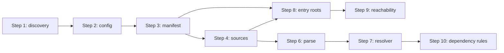

# Step 4: Source File Discovery 設計

解析パイプライン §6 の **処理ステップ 4 (source file discovery)** の実装設計。
Step 3 (`extract_manifest`) の直後に位置し、解析対象となる **Python ファイル集合** と **layout 推定**、
**file context**（runtime / test / docs / dev）を提供して、後続の parse / entry / reachability が
参照する `DiscoveredSources` を供給する。

## 1. 目的

| 項目 | 内容 |
| --- | --- |
| 解決する問題 | 「どの `.py` ファイルを解析するか」を zero-config で推定し、exclude / gitignore / production フィルタを適用した一覧を型安全に提供する |
| 成果物 | `discover_sources(&ProjectRoot, &LoadedConfig, &LoadedManifest) -> Result<DiscoveredSources, SourcesError>` |
| Phase 0 との関係 | graph core / parser spike と **並行可能**。ファイルシステム走査と glob マッチのみで Python 非実行を維持 |
| 後続ステップへの入力 | Step 6 (parse) の入力ファイル列、Step 8 (entry root) の layout ヒント、Step 9 (reachability) の project files 集合、Step 10 (dependency rules) の file context |

## 2. スコープ

### In scope

- `[tool.chokkin].project` glob の **展開**（空のときは layout 自動推定 globs を生成）
- **layout 推定**: src layout / flat layout / fallback（§2 UX、§8）
- root 配下の **下方向スキャン**（Step 1 の上方向探索の対偶）
- `exclude` glob と **既定除外**（`.venv/**` 等）の適用
- `respect_gitignore` による `.gitignore` 尊重（§5 既定 `true`）
- 各ファイルへの **file context** 付与（§10 の入力）
- `production = true` 時の **context フィルタ**（test / docs / dev / lint / type を解析対象外に）
- `config.entry` に指定されたパスの **存在検証**（欠落は warning、解析は継続）
- `.py` / `.pyi` の分類（`.pyi` は parse 対象外だが project に含めるかは Step 6 へ委譲。Step 4 では `FileKind` で区別）
- `src/sources/` として単体テスト可能な library API を提供する

### Out of scope（後続ステップ）

| 項目 | 担当ステップ |
| --- | --- |
| Python AST パース | Step 6 (parse) |
| entry root の自動推定（`manage.py` 等） | Step 8 (entry root construction) |
| `mode = "auto"` の app / library 解決 | Step 8 前の `resolve_mode` |
| plugin による追加 entry / config 参照 | Step 5 (config/plugin extraction) |
| import 解決・到達性解析 | Step 7–9 |
| CHK001 判定 | Step 12 (issue emission) |
| workspace member ごとの別 `DiscoveredSources` | v0.2（Step 2 の `WorkspaceOverride` は読むが member 展開はしない） |
| `# chokkin: file-ignore` の解釈 | Step 6（コメント保持が必要） |
| `ignore` 設定パターンのマッチ | Step 12 |
| CLI 縦スライス（ファイル件数表示） | 別 PR（Step 4 exit criteria 達成後） |

## 3. 仕様との対応

### 3.1 layout 自動推定（`project = []` のとき）

§2 の zero-config UX と §8 の mode 判定入力に使う layout を推定する。

**推定順（root 相対）:**

```text
1. src layout
   条件: <root>/src/ がディレクトリであり、
         <root>/src/<name>/__init__.py が 1 つ以上存在
   推定 package 名: 該当ディレクトリ名（複数あればすべて保持）

2. flat layout
   条件: <root>/<name>/__init__.py が存在し、
         かつ <name> が慣習的な非 package 名でない
         （tests, scripts, docs, build, dist, .venv は除外）
   推定 package 名: 該当ディレクトリ名

3. fallback（layout 不明）
   条件: 1–2 に該当しない
   推定 globs: 下記「既定 globs」
```

**`manifest.metadata.name` の利用:**

- flat layout で package ディレクトリが複数候補のとき、`[project].name` を正規化
  （`acme-api` → `acme_api` → `acme` の **完全一致優先**、なければ先頭候補 + `SourcesWarning::AmbiguousFlatLayout`）
- src layout では `src/<name>/` の `<name>` を優先（metadata.name は補助）

**自動生成される `project` globs（layout 別）:**

| layout | 生成 globs |
| --- | --- |
| src | `src/**/*.py` |
| flat（package = `acme`） | `acme/**/*.py` |
| fallback | `**/*.py`（root 直下の単発 `.py` も含む。深さ制限は §3.4） |

**常に追加する慣習 globs（layout に関わらず）:**

```text
tests/**/*.py
scripts/**/*.py
```

`docs/**/*.py` は v0.1 では **含めない**（`docs/conf.py` は Step 8 の entry 推定で個別に扱う。docs 配下の大量 `.py` で unused file 誤検知を避ける）。

ユーザーが `project` を明示指定した場合は **置換**（defaults へのマージはしない）。Step 2 の zero-config 契約に従う。

### 3.2 走査とフィルタ

**走査ルート:** `ProjectRoot.path` のみ（v0.1 は member 配下を自動スキャンしない）。

**処理順:**

```text
1. effective_globs ← config.project が空なら infer_layout_globs()、否则 config.project
2. globset ← effective_globs を union（OR）
3. walker ← WalkDir(root) + exclude globset + optional gitignore overlay
4. 各ファイル:
     a. 拡張子 .py / .pyi のみ候補
     b. project glob にマッチするか
     c. exclude / gitignore で落ちていないか
     d. production 時に file context が解析対象外でないか
     e. DiscoveredFile として記録
5. config.entry の各 path を存在確認（warning のみ）
6. layout + files + warnings を DiscoveredSources に格納
```

**深さ制限（fallback `**/*.py` の安全弁）:**

- シンボリックリンクは辿らない（`walkdir` の `follow_links(false)`）
- `max_depth` は設けないが、exclude 既定で `build/**`, `dist/**`, `.venv/**`, `**/__pycache__/**` を除外
- 10,000 files 超で `SourcesWarning::LargeProject`（解析は継続。§19 の perf 目標の入力）

### 3.3 file context 割当（§10）

path ベースで **1 ファイル 1 context**（plugin 上書きは Step 5）。

| パターン（root 相対、`\` / `/` 両対応） | context |
| --- | --- |
| `tests/**`, `**/test_*.py`, `**/*_test.py` | `Test` |
| `docs/**` | `Docs` |
| `scripts/**`, `noxfile.py` | `Dev` |
| `src/**`（src layout） | `Runtime` |
| flat layout の package 配下 `**` | `Runtime` |
| 上記以外の `.py`（root 直下 `manage.py` 等） | `Runtime` |

`production = true` のとき **除外する context**:

```text
Test, Docs, Dev
```

（lint / type は file 側ではなく dependency 側の概念。Step 4 では `Dev` に含めない。）

`FileContext` は `Copy` な列挙型とし、Step 10 の CHK005 判定入力とする。

### 3.4 entry パス検証

`config.entry` の各 `EntrySpec.path` について:

- root 相対で `root.join(path)` がファイルとして存在 → OK
- 存在しない → `SourcesWarning::MissingEntryPath { path, origin: "config" }`
- ディレクトリ → `SourcesWarning::EntryPathIsDirectory { path }`

entry の自動推定そのものは Step 8。Step 4 は **ユーザー明示 entry の健全性** のみ検査する。

### 3.5 gitignore

`respect_gitignore = true`（既定）のとき:

- root の `.gitignore` を読み、`ignore` crate の `Gitignore` ビルダで overlay
- 親ディレクトリの gitignore は **辿らない**（project root 外は解析しない前提）
- `.gitignore` 不在 → スキップ（エラーにしない）
- 読み取り失敗 → `SourcesWarning::GitignoreUnreadable` + gitignore なしで継続

`respect_gitignore = false` のときは glob / exclude のみ。

## 4. モジュール構成

```
src/
  lib.rs
  discovery/          # Step 1（既存）
  config/             # Step 2（既存）
  manifest/           # Step 3（既存）
  sources/
    mod.rs            # 公開 API と re-export
    error.rs          # SourcesError
    types.rs          # DiscoveredSources, DiscoveredFile, ProjectLayout, FileContext
    warnings.rs       # SourcesWarning
    layout.rs         # infer_layout, default_globs
    context.rs        # assign_file_context
    glob.rs           # globset 構築、マッチ
    walk.rs           # walk + gitignore + exclude
    discover.rs       # discover_sources 実装
```

`main.rs` は Step 4 では触らない。CLI 統合は exit criteria 達成後の別 PR。

## 5. データ型

### 5.1 列挙型

```rust
/// Detected project layout (§2, §8).
#[derive(Debug, Clone, Copy, PartialEq, Eq)]
pub enum ProjectLayout {
    /// `src/<package>/` tree.
    Src,
    /// `<package>/` at repository root.
    Flat,
    /// Could not infer src/flat; broad globs used.
    Unknown,
}

/// File-side dependency context (§10).
#[derive(Debug, Clone, Copy, PartialEq, Eq, Hash)]
pub enum FileContext {
    Runtime,
    Test,
    Docs,
    Dev,
}

/// Kind of Python-related file on disk.
#[derive(Debug, Clone, Copy, PartialEq, Eq)]
pub enum FileKind {
    Python,
    Stub, // .pyi
}
```

### 5.2 構造体

```rust
/// One discovered file under the project root.
#[derive(Debug, Clone, PartialEq, Eq)]
pub struct DiscoveredFile {
    /// Root-relative path using `/` separators (§ cross-platform).
    pub path: String,
    pub kind: FileKind,
    pub context: FileContext,
}

/// Layout inference result.
#[derive(Debug, Clone, PartialEq, Eq)]
pub struct LayoutInfo {
    pub layout: ProjectLayout,
    /// Package directory names (e.g. `acme` for `src/acme` or `acme/`).
    pub packages: Vec<String>,
    /// Globs used when `config.project` was empty.
    pub inferred_globs: Vec<String>,
}

/// Outcome of source file discovery.
#[derive(Debug, Clone, PartialEq, Eq)]
pub struct DiscoveredSources {
    pub root: ProjectRoot,
    /// Layout inference (even when user supplied explicit `project` globs).
    pub layout: LayoutInfo,
    /// Globs that were effectively used (explicit or inferred).
    pub effective_globs: Vec<String>,
    /// Files selected for analysis, sorted by path.
    pub files: Vec<DiscoveredFile>,
    /// Non-fatal conditions (missing entry paths, ambiguous layout, …).
    pub warnings: Vec<SourcesWarning>,
}
```

`DiscoveredSources::python_files()` ヘルパで `.py` のみをイテレート（Step 6 向け）。

### 5.3 `SourcesError`

```rust
#[derive(Debug, thiserror::Error)]
pub enum SourcesError {
    #[error("invalid glob pattern `{pattern}`: {reason}")]
    InvalidGlob { pattern: String, reason: String },

    #[error("failed to read project root `{path}`")]
    Io {
        path: PathBuf,
        #[source]
        source: std::io::Error,
    },
}
```

glob 構築失敗と走査時の致命的 IO のみ。個別ファイルの読み取り不可は Step 6 で扱う。

### 5.4 `SourcesWarning`

| 変体 | 条件 |
| --- | --- |
| `MissingEntryPath { path }` | `config.entry` が存在しないファイルを指す |
| `EntryPathIsDirectory { path }` | entry がディレクトリ |
| `AmbiguousFlatLayout { candidates, chosen }` | flat で複数 package 候補 |
| `GitignoreUnreadable { path }` | `.gitignore` 読み取り失敗 |
| `LargeProject { file_count }` | 閾値超過（10_000） |

## 6. 公開 API

```rust
// src/sources/mod.rs

pub use discover::discover_sources;
pub use error::SourcesError;
pub use types::{
    DiscoveredFile, DiscoveredSources, FileContext, FileKind, LayoutInfo, ProjectLayout,
};
pub use warnings::SourcesWarning;

/// Discover Python source files under `root` using config and manifest hints.
pub fn discover_sources(
    root: &ProjectRoot,
    config: &LoadedConfig,
    manifest: &LoadedManifest,
) -> Result<DiscoveredSources, SourcesError>;
```

`lib.rs` から re-export:

```rust
pub mod sources;
pub use sources::{discover_sources, DiscoveredSources, SourcesError, /* … */};
```

## 7. アルゴリズム詳細

### 7.1 `infer_layout`

```rust
fn infer_layout(root: &Path, metadata: &ProjectMetadata) -> LayoutInfo;
```

1. `src/` 配下の `*/__init__.py` を列挙 → 1 件以上で `Src` + packages
2. else root 直下の `*/__init__.py`（除外名フィルタ後）→ `Flat` + packages
3. else `Unknown` + packages = `[]`
4. `default_globs(layout, packages)` を `inferred_globs` に格納

### 7.2 `build_matcher`

- `globset::GlobSet` に `effective_globs` をコンパイル
- 別 `GlobSet` に `config.exclude` + ハードコード除外（config に無くても `**/__pycache__/**` は常に除外）
- マッチは **プロジェクト glob にマッチし、かつ exclude にマッチしない** ものを採用

glob 構文は `globset` 既定（`**` 再帰対応）。Windows パスは走査時に `/` 正規化してからマッチ。

### 7.3 `collect_files`

```rust
fn collect_files(
    root: &Path,
    project_matcher: &GlobSet,
    exclude_matcher: &GlobSet,
    gitignore: Option<&Gitignore>,
    production: bool,
) -> Result<Vec<DiscoveredFile>, SourcesError>;
```

- `walkdir::WalkDir::new(root).min_depth(1)` — root 自体の `setup.py` 等はファイルとして個別に評価される
- 各 entry: シンボリックリンクスキップ、gitignore ヒットでスキップ
- 相対 path を `/` 区切り文字列に正規化（`path_slash` 相当は自前 — 新規依存を避けるなら `to_string_lossy` + `MAIN_SEPARATOR` 置換）

### 7.4 `discover_sources` 本体

```rust
pub fn discover_sources(
    root: &ProjectRoot,
    config: &LoadedConfig,
    manifest: &LoadedManifest,
) -> Result<DiscoveredSources, SourcesError> {
    let layout = infer_layout(&root.path, &manifest.metadata);
    let effective_globs = if config.effective.project.is_empty() {
        layout.inferred_globs.clone()
    } else {
        config.effective.project.clone()
    };
    // build matchers, walk, validate entries, assemble
}
```

## 8. エッジケースと期待挙動

| シナリオ | 期待結果 |
| --- | --- |
| `project = []`, `src/pkg/__init__.py` あり | layout = Src, globs に `src/**/*.py`, `tests/**`, `scripts/**` |
| `project = []`, flat `acme/__init__.py` のみ | layout = Flat, `acme/**/*.py` + 慣習 globs |
| `project = ["custom/**/*.py"]` 明示 | layout 推定は情報として保持、globs は明示値のみ |
| `exclude` に `tests/**` | tests 配下は files に含まれない |
| `respect_gitignore = true`, `.gitignore` に `local/` | `local/` 配下除外 |
| `production = true` | `Test`/`Docs`/`Dev` context のファイルは除外 |
| `entry = ["missing.py"]` | warning、files には影響しない |
| requirements-only root（manifest name なし） | flat 推定はディレクトリ名ヒューリスティックのみ |
| 空リポジトリ（`.py` 無し） | `files = []`、エラーではない |
| 無効 glob `src/[unclosed` | `SourcesError::InvalidGlob` |

## 9. テスト計画

`src/sources/` 内 `#[cfg(test)]` と `tests/sources_discover.rs` の 2 層。

### 9.1 フィクスチャ構成

```
tests/fixtures/sources/
  src_layout/              # src/acme/__init__.py + tests + scripts
  flat_layout/             # acme/__init__.py at root
  fallback_layout/         # lone manage.py at root, no package
  explicit_globs/          # pyproject with [tool.chokkin] project = [...]
  exclude_tests/           # exclude = ["tests/**"]
  gitignore_respected/     # .gitignore ignores local/
  production_mode/         # production = true in chokkin.toml
  missing_entry/           # entry points to nonexistent file
  ambiguous_flat/          # two packages at root + metadata.name
  nested_ignored/          # .venv/, __pycache__/ populated
```

各フィクスチャは `discover_project_root` + `load_config` + `extract_manifest` 可能な最小構成。

### 9.2 テストケース一覧

| # | テスト名 | 検証内容 |
| --- | --- | --- |
| T1 | `infers_src_layout` | Src + packages + globs |
| T2 | `infers_flat_layout` | Flat + package glob |
| T3 | `fallback_glob_when_no_layout` | Unknown + `**/*.py` |
| T4 | `honors_explicit_project_globs` | 自動 globs を使わない |
| T5 | `applies_exclude` | tests 除外 |
| T6 | `respects_gitignore` | ignored パス除外 |
| T7 | `skips_gitignore_when_disabled` | respect_gitignore = false |
| T8 | `filters_production_contexts` | test/docs/dev 除外 |
| T9 | `assigns_file_context` | path → context 表 |
| T10 | `warns_missing_entry_path` | warning 生成 |
| T11 | `includes_pyi_as_stub_kind` | FileKind::Stub |
| T12 | `invalid_glob_returns_error` | InvalidGlob |
| T13 | `paths_use_forward_slashes` | cross-platform 正規化 |
| T14 | `empty_project_returns_empty_files` | エラーにしない |

### 9.3 カバレッジ目標

- `layout.rs` / `context.rs` / `glob.rs` の分岐網羅
- `walk.rs` は gitignore 有無の 2 パターン
- 統合テストで Step 1–3 パイプラインとの接続を 1 本（`full_pipeline_step4`）

## 10. 依存関係

| Crate | 用途 | Step 4 で追加 |
| --- | --- | --- |
| `thiserror` | `SourcesError` | 既存 |
| `globset` | glob コンパイル・マッチ | Yes — MIT/Apache-2.0 |
| `walkdir` | 下方向走査 | Yes — MIT/Apache-2.0 |
| `ignore` | `.gitignore` | Yes — MIT/Apache-2.0 |
| `tempfile` | テスト | 既存 (dev) |

追加後 `cargo deny check` を通す。`multiple-versions` warning は既存方針どおり許容。

## 11. 将来の CLI 統合（参考）

```rust
let root = discover_project_root(start)?;
let loaded = load_config(&root)?;
let manifest = extract_manifest(&root, &loaded)?;
let sources = discover_sources(&root, &loaded, &manifest)?;

// Phase 0 縦スライス: debug 出力例
// eprintln!("Layout: {:?}", sources.layout.layout);
// eprintln!("Python files: {}", sources.files.iter().filter(|f| f.kind == FileKind::Python).count());
```

Step 4 完了時点の Phase 0 exit 寄与: **layout と `.py` 件数を CLI に表示**し、
`uvx chokkin` が manifest 件数に加えて **解析対象ファイルの存在** を示す。

## 12. Exit criteria（Step 4 完了定義）

- [x] `src/sources/` が `make check` を通過する
- [x] `discover_sources` が `pub` API として `lib.rs` から re-export される
- [x] `project = []` で src / flat / fallback layout を推定できる
- [x] `exclude` / `respect_gitignore` / `production` が反映される
- [x] 各ファイルに `FileContext` が付与される
- [x] 欠落 entry パスが warning になる
- [x] production コードに `unwrap` / `expect` / `panic` がない
- [x] `docs/dev/spec.ja.md` §6 処理順 Step 4 に `sources/` モジュール名が追記される（`update-docs`）
- [x] `cargo deny check` が新規依存追加後も通過する

## 13. 実装順序（推奨）

```text
1. Cargo.toml に globset, walkdir, ignore を追加（deny 確認）
2. sources/error.rs — SourcesError
3. sources/types.rs — データ型
4. sources/warnings.rs — SourcesWarning
5. sources/layout.rs — infer_layout, default_globs
6. sources/context.rs — assign_file_context
7. sources/glob.rs — matcher 構築
8. sources/walk.rs — collect_files
9. sources/discover.rs — discover_sources
10. sources/mod.rs — re-export
11. lib.rs — pub mod sources
12. tests/fixtures/sources/* + tests/sources_discover.rs
13. make check
14. update-docs（spec.ja.md §6, AGENTS.md）
```

所要: 新規 Rust ファイル 9、テストフィクスチャ 10 前後、依存 3 crate。Step 3 完了済みが前提。

## 14. 未決事項（Step 4 では保留）

| 項目 | 理由 | 再検討タイミング |
| --- | --- | --- |
| `docs/**` を project に含めるか | unused file 誤検知 | Step 8 entry 推定と合わせて v0.1 後半 |
| workspace member 別走査 | v0.2 scope | Phase 2 |
| 並列 walk | 中規模で十分速い | §19 perf 未達時 |
| `pyproject.toml` の `[tool.setuptools.packages]` 読み取り | layout 精度向上 | manifest / layout 統合 PR |
| hardlink / case-insensitive FS の重複 | 稀 | バグ報告時 |

## 15. update-plan 検証サマリ

### Phase 1: コンテキスト収集

| 成果物 | 確認結果 |
| --- | --- |
| `docs/dev/plans/step-04-source-file-discovery.md` | 本プラン |
| `docs/dev/spec.ja.md` §2, §6 Step 4, §8, §10, §19 | layout / context / 処理順と一致 |
| `docs/dev/plans/step-01` – `step-03` | 入力 API 確定済み |
| `src/discovery/`, `src/config/`, `src/manifest/` | Step 1–3 完了 |
| `Cargo.toml` | `globset` / `walkdir` / `ignore` 追加予定 |

### Phase 2: 品質評価（100点満点）

| カテゴリ | 配点 | 得点 | 所見 |
| --- | ---: | ---: | --- |
| モジュール / struct 設計 | 20 | 19 | `sources/` 単一責務。layout と walk を分離 |
| 静的解析制約 | 20 | 20 | FS + glob のみ。Python 非実行を維持 |
| ルール / ポリシー | 20 | 18 | file context は CHK005 入力。判定は Step 10 |
| エラー処理 | 20 | 19 | 致命エラーと warning の分離が明確 |
| テスト容易性 | 20 | 19 | フィクスチャ 10 件・統合テスト 14 件を具体化 |
| **合計** | **100** | **95** | **合格**（90 以上） |

### Phase 3: 整合性チェック

| チェック項目 | 結果 |
| --- | --- |
| プランと `spec.ja.md` §6 処理ステップ 4 | OK |
| Step 2 `project = []` → Step 4 自動推定 | OK |
| Step 3 `metadata.name` 接続 | OK |
| `src/` 現行構成との衝突 | なし — 新規 `sources/` 追加 |
| 実装順序の依存関係 | OK — types → layout → walk → discover → tests |
| Phase 0 並行 work（graph / parser） | 独立。Step 6 前に parser spike 推奨 |

### Phase 4: 改善反映（課題分類）

| 優先度 | 課題 | 対応 |
| --- | --- | --- |
| **P1** | `AGENTS.md` は `sources/` 未記載 | 実装時 update-docs で追記（exit criteria に含む） |
| **P1** | graph core 未実装 | Step 4 は `DiscoveredFile` のみ。graph 統合は Step 6–9 |
| **P2** | `docs/**` 除外 | §14 で保留。`docs/conf.py` は Step 8 |

### 確定判定

**合格 — 実装着手可。** Step 4 は Step 1–3 のみに依存し、Step 6 (parse) へ
`DiscoveredSources` を渡す縦スライスの第 4 層として独立して実装可能。

## 16. 後続ステップへのインターフェース



| 消費者 | 使用する sources フィールド |
| --- | --- |
| Step 5 (plugins) | `files`（設定ファイル探索の種）、`layout` |
| Step 6 (parse) | `files`（`FileKind::Python`）、`root` |
| Step 8 (entry) | `layout`, `files`, manifest `entry_points` |
| Step 9 (reachability) | 全 `files` |
| Step 10 (rules) | `files[].context` |
| Step 12 (issues) | `warnings` → diagnostics |

## 17. 並行 work（Phase 0 残り）

Step 4 と **同時に着手可能** な Phase 0 項目:

| work | 目的 | 推奨タイミング |
| --- | --- | --- |
| **parser spike** | Ruff parser vs RustPython、§6 リスク評価 | Step 6 の 1–2 週前 |
| **graph core** | `File` / `Module` / edge 型の骨格 | Step 6 と同 PR でも可 |
| **package-module-map 初版** | Step 7 resolver の fallback data | Step 7 と同 PR |

Step 4 完了後の推奨順序:

```text
Step 4 (sources) → parser spike → Step 6 (parse) + graph core
                 ↘ Step 5 (plugins) は Step 6 と部分並行可
```
