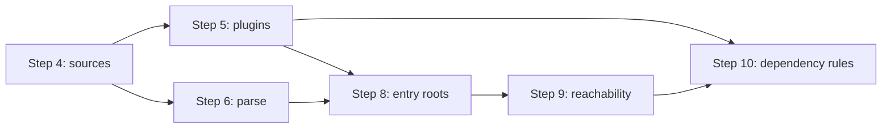

# Step 5: Config / Plugin Extraction 設計

解析パイプライン §6 の **処理ステップ 5 (config/plugin extraction)** の実装設計。
Step 4 (`discover_sources`) の直後に位置し、framework / test runner / CI 設定から
**暗黙の entry・module 参照・binary 使用** を静的に抽出して、Step 8 (entry root construction)
と Step 10 (dependency reconciliation) が消費する `PluginHints` を供給する。

> **関連プラン**
>
> - [`phase-0-parser-spike-graph-core.md`](./phase-0-parser-spike-graph-core.md) — Step 6 と部分並行可
> - Step 8 が本ステップの出力を entry グラフへ統合する

## 1. 目的

| 項目 | 内容 |
| --- | --- |
| 解決する問題 | Django `INSTALLED_APPS`、pytest test discovery、FastAPI/uvicorn 起動指定など **設定由来の暗黙参照** を検出し、unused dependency / unused file の誤検知を減らす |
| 成果物 | `extract_plugin_hints(...) -> Result<PluginHints, PluginsError>` |
| Phase 0 / 1 との関係 | v0.1 MVP の plugin 3 体（pytest / django / fastapi）を実装。graph / parser と部分並行可 |
| 後続ステップへの入力 | Step 8 (entry roots)、Step 9 (reachability)、Step 10 (YOK002/YOK008)、Step 12 (diagnostics) |

## 2. スコープ

### In scope（v0.1）

- `[tool.yokei.plugins]` で **有効化された plugin** のみ実行（§5 既定: pytest / django / fastapi = `true`）
- 各 plugin の 3 責務（§9）:
  1. **entry files** の追加
  2. **string / module references** の追加
  3. **binary usage** の追加
- 設定ファイルの **静的パースのみ**（TOML / INI / 限定 regex。Python **実行禁止** §20）
- `DiscoveredSources.files` / `layout` を利用した glob 展開（pytest test files 等）
- `framework-used` ファイル集合（Django migrations 等）のマーキング
- `src/plugins/` として単体テスト可能な library API

### Out of scope（後続ステップ）

| 項目 | 担当ステップ |
| --- | --- |
| `@router.get` / `@pytest.fixture` 等の **decorator 解析** | Step 6 (parse) — plugin は parse 結果を **消費** する拡張ポイントのみ定義 |
| entry グラフへの統合・BFS 到達性 | Step 8–9 |
| import 名 ↔ distribution 名解決 | Step 7 (resolver) |
| YOK001–YOK010 判定 | Step 10–12 |
| v0.2 plugin（celery / tox / nox / pre-commit / github-actions）の **本実装** | v0.2 — Step 5 では `PluginId` と **no-op stub** のみ |
| `.github/workflows/*.yml` YAML 解析 | v0.2 (`github_actions` plugin) |
| `pyproject.toml` `[tool.poetry]` / PDM 深掘り | v0.2 |
| workspace member ごとの別 `PluginHints` | v0.2 |
| `ignore` パターンのマッチ | Step 12 |
| CLI `--explain` / `--trace` | Phase 1 CLI PR |

## 3. 仕様との対応

### 3.1 Plugin 責務マッピング（§9）

| 出力種別 | 用途 | 消費者 |
| --- | --- | --- |
| `PluginEntry` | 到達性の root 候補 | Step 8 |
| `ModuleReference` | `ConfigReference uses Module` 辺 | Step 9–10 |
| `SymbolReference` | `module:symbol`（uvicorn `app:application` 等） | Step 8–9 |
| `BinaryUsage` | CLI コマンド → distribution（YOK008） | Step 10 |
| `FrameworkUsedGlob` | unused file から除外 / confidence 低下 | Step 9–12 |
| `FileContextOverride` | path → context 上書き（§10） | Step 4 補正は **再実行しない** — Step 8–10 が参照 |

### 3.2 v0.1 対象 plugin

| PluginId | 既定 | 主な設定ソース |
| --- | --- | --- |
| `Pytest` | `true` | `pyproject.toml` `[tool.pytest.ini_options]`、`pytest.ini`、`setup.cfg` `[tool:pytest]` |
| `Django` | `true` | `manage.py`、`settings.py`（静的抽出）、`pyproject` 依存ヒント |
| `Fastapi` | `true` | `pyproject` scripts / entry points、`[tool.uvicorn]`、README 的 `uvicorn pkg:app` 文字列（scripts 内） |
| その他 | `false` | stub — `PluginContribution::empty(plugin)` |

### 3.3 静的解析制約

```text
許可: ファイル読み取り、TOML/INI parse、正規表現、括弧深度パーサ（Step 3 setup.py 同等）
禁止: importlib、subprocess、対象プロジェクトの Python 実行
```

Django `settings.py` は **リテラル代入のみ** 抽出（`ast` 相当の Rust parser は Step 6 完了後に差し替え可能）。

## 4. モジュール構成

```
src/
  lib.rs
  plugins/
    mod.rs              # extract_plugin_hints, re-exports
    types.rs            # PluginHints, PluginContribution, references
    error.rs            # PluginsError
    warnings.rs         # PluginsWarning
    context.rs          # PluginContext（入力の束ね）
    extract.rs          # オーケストレーション（有効 plugin を順に実行）
    util.rs             # INI/TOML 読み取り、list literal 抽出、manage.py 解析
    pytest.rs
    django.rs
    fastapi.rs
    stub.rs             # v0.2 plugin の no-op
```

`graph/` への辺追加は Step 8 PR で行う。Step 5 は **ヒント構造体** のみ返す。

## 5. データ型

### 5.1 参照の出所

```rust
/// Where a plugin discovered a reference (for `--explain` / diagnostics).
#[derive(Debug, Clone, PartialEq, Eq)]
pub struct ReferenceOrigin {
    /// Root-relative path using `/` separators.
    pub file: String,
    /// 1-based line when known.
    pub line: Option<u32>,
    /// Human-readable label, e.g. `INSTALLED_APPS` or `tool.pytest.ini_options.testpaths`.
    pub label: String,
}
```

### 5.2 出力レコード

```rust
/// Additional entry root from a plugin (§9.1).
#[derive(Debug, Clone, PartialEq, Eq)]
pub struct PluginEntry {
    pub spec: EntrySpec,           // reuse config::EntrySpec
    pub context: FileContext,      // Test / Runtime / Dev
    pub origin: ReferenceOrigin,
}

/// Module name referenced from config (§9.2).
#[derive(Debug, Clone, PartialEq, Eq)]
pub struct ModuleReference {
    pub module: String,            // dotted name, e.g. `django.contrib.admin`
    pub origin: ReferenceOrigin,
}

/// `module:symbol` reference (uvicorn, gunicorn, etc.).
#[derive(Debug, Clone, PartialEq, Eq)]
pub struct SymbolReference {
    pub module: String,
    pub symbol: String,
    pub origin: ReferenceOrigin,
}

/// CLI binary usage (§9.3, YOK008).
#[derive(Debug, Clone, PartialEq, Eq)]
pub struct BinaryUsage {
    pub binary: String,            // e.g. `pytest`, `uvicorn`
    pub origin: ReferenceOrigin,
}

/// Glob of files treated as framework-used (excluded from unused-file candidates).
#[derive(Debug, Clone, PartialEq, Eq)]
pub struct FrameworkUsedGlob {
    pub pattern: String,           // root-relative glob
    pub origin: ReferenceOrigin,
}

/// Override file context assigned in Step 4 (§10).
#[derive(Debug, Clone, PartialEq, Eq)]
pub struct FileContextOverride {
    pub path: String,              // root-relative file or glob
    pub context: FileContext,
    pub origin: ReferenceOrigin,
}
```

### 5.3 `PluginContribution` / `PluginHints`

```rust
#[derive(Debug, Clone, PartialEq, Eq, Default)]
pub struct PluginContribution {
    pub plugin: PluginId,
    pub entries: Vec<PluginEntry>,
    pub module_refs: Vec<ModuleReference>,
    pub symbol_refs: Vec<SymbolReference>,
    pub binary_usages: Vec<BinaryUsage>,
    pub framework_used_globs: Vec<FrameworkUsedGlob>,
    pub file_context_overrides: Vec<FileContextOverride>,
}

#[derive(Debug, Clone, PartialEq, Eq)]
pub struct PluginHints {
    /// One record per plugin that ran (including empty stubs for traceability).
    pub contributions: Vec<PluginContribution>,
    pub warnings: Vec<PluginsWarning>,
}
```

`PluginHints` ヘルパ:

```rust
impl PluginHints {
  pub fn entries(&self) -> impl Iterator<Item = &PluginEntry>;
  pub fn module_refs(&self) -> impl Iterator<Item = &ModuleReference>;
  pub fn all_binary_usages(&self) -> impl Iterator<Item = &BinaryUsage>;
  pub fn merge_contributions(&self) -> MergedPluginHints; // Step 8 用
}
```

### 5.4 `PluginContext`

```rust
/// Read-only inputs for plugin extractors.
pub struct PluginContext<'a> {
    pub root: &'a ProjectRoot,
    pub config: &'a YokeiConfig,
    pub sources: &'a DiscoveredSources,
    pub manifest: &'a LoadedManifest,
}
```

Step 6 以降で `parsed_files: Option<&ParsedFileCache>` を追加する拡張ポイントを `context.rs` にコメントで予約。

### 5.5 エラー / warning

```rust
#[derive(Debug, thiserror::Error)]
pub enum PluginsError {
    #[error("failed to read `{path}`")]
    Io { path: PathBuf, #[source] source: std::io::Error },

    #[error("invalid config at `{path}`: {detail}")]
    InvalidConfig { path: String, detail: String },
}

#[derive(Debug, Clone, PartialEq, Eq)]
pub enum PluginsWarning {
    /// Plugin enabled but no recognizable config found.
    PluginNoOp { plugin: PluginId },
    /// settings.py found but list literals could not be parsed.
    PartialSettingsParse { path: String, fields: Vec<String> },
    /// pytest.ini exists but `[pytest]` section missing.
    PytestConfigUnreadable { path: String },
    /// Multiple settings.py candidates; first chosen.
    AmbiguousSettings { chosen: String, candidates: Vec<String> },
}
```

個別 plugin の失敗は **warning + 空 contribution** で継続（§20: 解析全体を止めない）。`PluginsError` は root 読み取り不能など致命的ケースのみ。

## 6. 公開 API

```rust
// src/plugins/mod.rs

pub use extract::extract_plugin_hints;
pub use types::{
    BinaryUsage, FrameworkUsedGlob, ModuleReference, PluginContribution, PluginEntry,
    PluginHints, ReferenceOrigin, SymbolReference,
};
pub use error::PluginsError;
pub use warnings::PluginsWarning;

/// Extract framework hints from tool configuration (§6 step 5).
pub fn extract_plugin_hints(
    root: &ProjectRoot,
    config: &LoadedConfig,
    sources: &DiscoveredSources,
    manifest: &LoadedManifest,
) -> Result<PluginHints, PluginsError>;
```

`lib.rs`:

```rust
pub mod plugins;
pub use plugins::{extract_plugin_hints, PluginHints, PluginsError, /* … */};
```

## 7. Plugin 別アルゴリズム

### 7.1 pytest (`plugins/pytest.rs`)

**前提:** `config.plugins[Pytest] == true`

#### 7.1.1 設定読み取り（優先順）

```text
1. <root>/pyproject.toml     → [tool.pytest.ini_options]
2. <root>/pytest.ini         → [pytest]
3. <root>/setup.cfg          → [tool:pytest]
4. <root>/tox.ini            → [testenv] pytest 行（v0.1: binary usage のみ。本格 tox は v0.2）
```

`pyproject.toml` は `toml` crate。`pytest.ini` / `setup.cfg` は `util::read_ini_section`（新規: 行ベース INI、Python configparser 互換の `:` / `=` 区切り）。

#### 7.1.2 抽出するキー

| キー | 出力 |
| --- | --- |
| `testpaths` | entry root 候補（ディレクトリ → 配下 test file を entry 化） |
| `python_files` | test file glob 上書き（既定: `test_*.py`, `*_test.py`） |
| `python_classes` | v0.1 では **未使用**（warning のみ記録可） |
| `python_functions` | v0.1 では **未使用** |
| `pytest_plugins` | **Step 6 委譲** — conftest.py の AST 解析後に module_refs へ（Step 5 では origin ファイルパスのみ登録） |

#### 7.1.3 Test file entry 生成

```text
既定 glob（testpaths 未指定）:
  tests/**/test_*.py
  tests/**/*_test.py

testpaths = ["integration"] 指定時:
  integration/**/test_*.py
  integration/**/*_test.py
  （python_files 上書きがあればそれを使用）

sources.files に含まれるパスのみ entry 化（Step 4 exclude / production 済み集合）
```

各 test file → `PluginEntry { spec: path only, context: Test, origin }`

#### 7.1.4 固定 entry

| パス | context | 条件 |
| --- | --- | --- |
| `conftest.py`（全階層） | Test | `sources.files` に存在 |
| `tests/conftest.py` | Test | 同上 |

#### 7.1.5 Binary usage

```text
binary: pytest
origin: 設定ファイルまたは pyproject に pytest が dev/test 依存として宣言されている場合
```

### 7.2 django (`plugins/django.rs`)

**前提:** `config.plugins[Django] == true`

#### 7.2.1 Django プロジェクト検出

```text
1. <root>/manage.py が存在 → entry + settings module ヒント抽出
2. else manifest.dependencies に `django` がある → settings.py 探索
3. else → PluginWarning::PluginNoOp（plugin 有効だが痕跡なし）
```

#### 7.2.2 `manage.py` 静的解析

```python
os.environ.setdefault("DJANGO_SETTINGS_MODULE", "myproject.settings")
```

パターン: `DJANGO_SETTINGS_MODULE` に代入される **文字列リテラル** を regex で抽出。

成果物:

- `PluginEntry { manage.py, Runtime }`
- `ModuleReference { module: settings_module, origin }`（`ROOT_URLCONF` 解決の起点）

#### 7.2.3 `settings.py` 探索

```text
1. manage.py から得た dotted path → path（`myproject.settings` → `myproject/settings.py`）
2. else `**/settings.py` を root 配下で列挙（深さ ≤ 4）
   - 複数候補 → `AmbiguousSettings` warning、package 名と manifest.metadata.name 一致を優先
```

#### 7.2.4 settings からの list 抽出

対象フィールド（**大文字名前の代入**、右辺がリストリテラル）:

```text
INSTALLED_APPS
MIDDLEWARE
ROOT_URLCONF          # 単一文字列 → ModuleReference
WSGI_APPLICATION      # module:symbol → SymbolReference
ASGI_APPLICATION      # module:symbol → SymbolReference
```

`util::extract_python_list_literals(path, &[field_names])` — Step 3 `setup_py.rs` と共通化:

- 文字列要素のみ抽出（`"django.contrib.admin"`）
- 動的組み立て・変数参照はスキップ → `PartialSettingsParse` warning

各文字列 → `ModuleReference`（`django.apps` 形式はそのまま。`AppConfig` サフィックスは Step 7 で正規化検討）

#### 7.2.5 Framework-used files

```text
**/migrations/**/*.py
```

`FrameworkUsedGlob { pattern: "**/migrations/**/*.py" }` — `sources` に含まれるファイルは Step 9 で到達済み扱い。

#### 7.2.6 追加 entry

| パス | context |
| --- | --- |
| `manage.py` | Runtime |
| `settings.py`（特定された 1 件） | Runtime |
| `urls.py`（`ROOT_URLCONF` から解決できた場合） | Runtime |

### 7.3 fastapi (`plugins/fastapi.rs`)

**前提:** `config.plugins[Fastapi] == true`

#### 7.3.1 検出ヒント

```text
manifest.dependencies / optional-deps に `fastapi` または `uvicorn` がある
または
[project.scripts] / entry-points に uvicorn / fastapi 関連
```

#### 7.3.2 設定読み取り

| ソース | 抽出 |
| --- | --- |
| `pyproject.toml` `[tool.uvicorn]` | `app = "pkg.module:app"` → `SymbolReference` |
| `[project.scripts]` の `uvicorn ...` 値 | `module:symbol` regex |
| `DiscoveredSources` の `asgi.py` / `main.py`（root または `src/<pkg>/`） | `PluginEntry`（Step 8 自動推定と重複可 — マージ時に dedup） |

#### 7.3.3 Binary usage

```text
uvicorn  → binary_map / bundled map へ（Step 7）
fastapi  → 直接 CLI 使用は稀。module import 主体
```

#### 7.3.4 Step 6 への委譲

`@router.get` / `@app.post` decorated functions → **parse 層**で `externally_used_symbols` としてマーク。Step 5 の `PluginContribution` に `parse_extensions: Vec<ParseExtension>` を v0.1 では **空** で予約。

### 7.4 stub (`plugins/stub.rs`)

```rust
pub fn extract(plugin: PluginId, _ctx: &PluginContext<'_>) -> PluginContribution {
    PluginContribution { plugin, ..Default::default() }
}
```

`extract.rs` が `config.plugins[id] == false` のとき stub を **実行しない**（contributions に含めない）。`true` かつ v0.2 plugin のとき空 contribution + `PluginNoOp` warning。

## 8. オーケストレーション

```rust
pub fn extract_plugin_hints(
    root: &ProjectRoot,
    config: &LoadedConfig,
    sources: &DiscoveredSources,
    manifest: &LoadedManifest,
) -> Result<PluginHints, PluginsError> {
    let ctx = PluginContext { root, config: &config.effective, sources, manifest };
    let mut contributions = Vec::new();
    let mut warnings = Vec::new();

    for plugin in PluginId::all() {
        if !config.effective.plugins.get(plugin).copied().unwrap_or(false) {
            continue;
        }
        let (contrib, plugin_warnings) = match plugin {
            PluginId::Pytest => pytest::extract(&ctx)?,
            PluginId::Django => django::extract(&ctx)?,
            PluginId::Fastapi => fastapi::extract(&ctx)?,
            _ => stub::extract(plugin, &ctx),
        };
        warnings.extend(plugin_warnings);
        contributions.push(contrib);
    }

    Ok(PluginHints { contributions, warnings })
}
```

**不変条件:**

1. contribution 内の path は **root 相対 `/` 区切り**
2. `sources.files` に無い path を entry にしてもよい（欠落 entry は Step 4 と同様 Step 12 で warning）
3. 同一 `(plugin, module, origin.file)` は dedup 可能だが **必須ではない**（Step 8 でマージ）

## 9. テスト計画

### 9.1 フィクスチャ

```
tests/fixtures/plugins/
  pytest_pyproject/          # [tool.pytest.ini_options] testpaths
  pytest_ini/                # pytest.ini のみ
  pytest_setup_cfg/          # setup.cfg [tool:pytest]
  django_manage/             # manage.py + mysite/settings.py + INSTALLED_APPS
  django_partial_settings/   # 動的 INSTALLED_APPS → PartialSettingsParse
  django_migrations/         # migrations/*.py → framework-used
  fastapi_uvicorn_tool/      # [tool.uvicorn] app =
  fastapi_scripts/           # [project.scripts] start = "uvicorn pkg.main:app"
  plugins_disabled/          # plugins.pytest = false → 空
  monorepo_django/           # src layout + manage.py
```

### 9.2 統合テスト（`tests/plugins_extract.rs`）

| ID | テスト名 | 検証内容 |
| --- | --- | --- |
| PL1 | `pytest_discovers_test_files` | test_*.py が Test context entry になる |
| PL2 | `pytest_respects_testpaths` | testpaths 上書き |
| PL3 | `pytest_conftest_entry` | conftest.py entry |
| PL4 | `pytest_binary_usage` | BinaryUsage `pytest` |
| PL5 | `django_installed_apps` | INSTALLED_APPS → module_refs |
| PL6 | `django_migrations_framework_used` | migrations glob |
| PL7 | `django_manage_entry` | manage.py entry |
| PL8 | `fastapi_uvicorn_app_symbol` | SymbolReference |
| PL9 | `disabled_plugin_skipped` | contributions に含まれない |
| PL10 | `full_pipeline_step5` | Steps 1–5 接続 |
| PL11 | `partial_settings_warns` | PartialSettingsParse |
| PL12 | `no_django_no_panic` | PluginNoOp、エラーなし |

### 9.3 単体テスト

- `util.rs`: list literal 抽出、manage.py regex、INI section
- 各 `pytest.rs` / `django.rs` / `fastapi.rs`: フィクスチャ 1–2 件ずつ

## 10. 依存関係

| Crate | 用途 | Step 5 |
| --- | --- | --- |
| `thiserror` | エラー型 | 既存 |
| `toml` | pyproject | 既存 |
| `globset` | test file / migration glob | 既存 |
| `regex` | manage.py / uvicorn 文字列 | Yes — MIT/Apache 互換を選定 |

**追加しない（v0.2）:** `serde_yaml`（GitHub Actions）、`quick-xml`

共通化: `util::extract_python_list_literals` は `manifest/setup_py.rs` から移動または `src/util/` 共有モジュール化を検討。

## 11. Exit criteria（Step 5 完了定義）

- [ ] `src/plugins/` が `make check` を通過する
- [ ] `extract_plugin_hints` が `lib.rs` から re-export される
- [ ] pytest / django / fastapi の v0.1 抽出が §9 例と一致する
- [ ] v0.2 plugin は stub で panic しない
- [ ] production コードに `unwrap` / `expect` / `panic` がない
- [ ] `docs/dev/spec.ja.md` §6 処理順 Step 5 に `plugins/` が追記される（`update-docs`）
- [ ] `AGENTS.md` の `plugins/` が実装済みに更新される
- [ ] `cargo deny check` が新規依存（`regex`）追加後も通過する

## 12. 実装順序（推奨）

```text
1. plugins/types.rs, error.rs, warnings.rs
2. plugins/util.rs — INI + list literal（setup_py 共通化）
3. plugins/context.rs
4. plugins/pytest.rs + fixture PL1–PL4
5. plugins/django.rs + fixture PL5–PL7, PL11
6. plugins/fastapi.rs + fixture PL8
7. plugins/stub.rs
8. plugins/extract.rs + mod.rs
9. lib.rs — pub mod plugins
10. tests/plugins_extract.rs — PL1–PL12
11. make check
12. update-docs（spec.ja.md §6, §9, AGENTS.md）
```

所要: 新規 Rust ファイル 11 前後、fixture 10、依存 1 crate（`regex`）。

## 13. 後続ステップへのインターフェース



| 消費者 | 使用するフィールド |
| --- | --- |
| Step 6 (parse) | conftest / settings / urls の `ReferenceOrigin`（ignore / string ref 拡張） |
| Step 8 (entry) | `PluginEntry`, `SymbolReference`, test file entries |
| Step 9 (reachability) | `ModuleReference`, `FrameworkUsedGlob` |
| Step 10 (rules) | `BinaryUsage` → YOK008 |
| Step 12 (issues) | `PluginsWarning` → diagnostic |

### Step 8 マージ規則（予告）

```text
entry_roots = config.entry
            ∪ manifest.entry_points
            ∪ plugin_hints.entries
            ∪ auto_detected_entries   # manage.py 等と重複は path で dedup
```

## 14. 未決事項

| 項目 | 理由 | 再検討 |
| --- | --- | --- |
| `pytest_plugins` の AST 抽出 | conftest 要 parse | Step 6 完了後 |
| `AppConfig` 形式の正規化 | `myapp.apps.MyAppConfig` → `myapp` | Step 7 |
| `settings.py` の `import *` | 静的不可 | ドキュメント化のみ |
| tox / nox plugin | v0.2 scope | §16 |
| plugin 自動有効化（依存から推論） | zero-config 体験 | v0.1 後半 — 既定 true で十分か検証 |
| 共有 `src/util/` モジュール | setup_py と list 抽出重複 | 実装時にリファクタ |

## 15. update-plan 検証サマリ（ドラフト）

### Phase 1: コンテキスト収集

| 成果物 | 確認結果 |
| --- | --- |
| `docs/dev/plans/step-05-config-plugin-extraction.md` | 本プラン |
| `docs/dev/spec.ja.md` §6 Step 5, §9, §10, §16 | plugin 責務・v0.1 scope と一致 |
| `docs/dev/plans/step-02` – `step-04` | `PluginId` / `EntrySpec` / `DiscoveredSources` 確定済み |
| `phase-0-parser-spike-graph-core.md` | 並行 work として整合 |

### Phase 2: 品質評価（100点満点）

| カテゴリ | 配点 | 得点 | 所見 |
| --- | ---: | ---: | --- |
| モジュール / struct 設計 | 20 | 19 | plugin ごとにファイル分割。`PluginHints` は Step 8 向け |
| 静的解析制約 | 20 | 20 | Python 非実行。list literal 限定 |
| ルール / ポリシー | 20 | 19 | §9 三責務を型で表現 |
| エラー処理 | 20 | 18 | plugin 失敗は warning 継続 |
| テスト容易性 | 20 | 19 | fixture 10 + 統合 12 件 |
| **合計** | **100** | **95** | **合格**（90 以上） |

### Phase 3: 整合性チェック

| チェック項目 | 結果 |
| --- | --- |
| プランと `spec.ja.md` §6 処理ステップ 5 | OK |
| Step 2 `plugins` フラグ | OK — 有効時のみ実行 |
| Step 4 `sources.files` | OK — entry は discovered 集合と突合 |
| Step 6 / Phase 0 との境界 | OK — decorator / AST は Step 6 |
| `src/` 現行構成との衝突 | なし — 新規 `plugins/` |

### 確定判定

**合格 — 実装着手可。** Step 5 は Step 2–4 のみに依存し、Phase 0 parser / graph と部分並行可能。
